# Historical Trade Evidence Pack

## Scope and limitations

This pack contains transparent examples from the frozen Regime-Gated Pullback swing strategy. Every example is a **retrospective holdout** and **out-of-sample** observation from the unused 2016-07-01 through 2021-07-10 window. None is a live forward-validation trade.

**These examples do not guarantee future profitability.** They show how fixed rules behaved on selected historical candles after costs and slippage.

- Strategy version: `regime-gated-pullback-v1.0.0`
- Examples: 30 (10 winners, 10 losers, 5 expired signals, 5 rejected candidates)
- Sectors covered: Communication Services, Consumer Discretionary, Consumer Staples, Energy, Financials, Health Care, Industrials, Materials, Real Estate, Technology, Utilities
- Historical regimes covered: Bear, Bull, Sideways
- Signal years covered: 2017, 2018, 2019, 2020, 2021
- Account illustration: £10,000 cash account with a 1% (£100) maximum risk budget; whole shares only and no leverage.
- Currency assumption: historical US price units are treated as GBP-equivalent for the requested sizing illustration; no historical USD/GBP conversion is applied.
- Execution: 5 bps adverse entry/exit slippage, 5 bps transaction cost per side, 50% at TP1, original stop retained, and stop-first same-candle handling.
- The source holdout ledger normalizes trades to 100 shares. Monetary legs below replay the requested account size; odd whole-share splits can therefore produce a small R difference while dates, levels, and fills remain identical.

## Audit method

For each signal, the analysis engines receive only stock and SPY candles timestamped at or before the signal close. The EMA20, EMA50, ATR, swing low, entry, stop, targets, position size, execution legs, costs, R result, MFE, and MAE are recomputed from bundled raw OHLCV. Executed examples are reconciled to the locked source ledger; expired and rejected examples are verified to contain no entry or exit.

The raw snapshots are stored in `artifacts/trade_evidence/raw/`, the selected source rows in `artifacts/trade_evidence/selected_trade_ledger.json`, and the full machine-readable audit in `artifacts/trade_evidence_summary.json`.

## Evidence index

| ID | Outcome | Ticker | Sector | Signal | Regime | Confidence | Recommendation | Final R |
| --- | --- | --- | --- | --- | --- | ---: | --- | ---: |
| [E01](#e01-winner-orcl) | WINNER | ORCL | Technology | 2017-05-10 | Bull | 68 | WATCH | 2.9706R |
| [E02](#e02-winner-tmo) | WINNER | TMO | Health Care | 2017-04-19 | Bull | 70 | WATCH | 2.9501R |
| [E03](#e03-winner-low) | WINNER | LOW | Consumer Discretionary | 2018-08-06 | Bull | 73 | WATCH | 2.9580R |
| [E04](#e04-winner-blk) | WINNER | BLK | Financials | 2018-01-02 | Bull | 81 | BUY | 3.0515R |
| [E05](#e05-winner-cost) | WINNER | COST | Consumer Staples | 2019-02-08 | Sideways | 53 | SKIP | 2.3908R |
| [E06](#e06-winner-well) | WINNER | WELL | Real Estate | 2019-02-22 | Sideways | 73 | WATCH | 0.3907R |
| [E07](#e07-winner-nem) | WINNER | NEM | Materials | 2020-02-13 | Bull | 71 | WATCH | 2.9830R |
| [E08](#e08-winner-abt) | WINNER | ABT | Health Care | 2020-08-18 | Bull | 70 | WATCH | 1.8938R |
| [E09](#e09-winner-psa) | WINNER | PSA | Real Estate | 2021-05-17 | Bull | 76 | BUY | 2.4330R |
| [E10](#e10-winner-duk) | WINNER | DUK | Utilities | 2021-04-30 | Bull | 67 | WATCH | 1.4052R |
| [E11](#e11-loser-cl) | LOSER | CL | Consumer Staples | 2017-04-19 | Bull | 74 | WATCH | -1.0552R |
| [E12](#e12-loser-xom) | LOSER | XOM | Energy | 2017-07-19 | Bull | 54 | SKIP | -1.0475R |
| [E13](#e13-loser-sbux) | LOSER | SBUX | Consumer Discretionary | 2018-06-04 | Bull | 64 | WATCH | -1.0388R |
| [E14](#e14-loser-jnj) | LOSER | JNJ | Health Care | 2018-10-03 | Bull | 74 | WATCH | -1.0333R |
| [E15](#e15-loser-ko) | LOSER | KO | Consumer Staples | 2019-01-28 | Bear | 52 | SKIP | -1.0298R |
| [E16](#e16-loser-bac) | LOSER | BAC | Financials | 2019-02-13 | Sideways | 65 | WATCH | -1.0308R |
| [E17](#e17-loser-itw) | LOSER | ITW | Industrials | 2020-01-14 | Bull | 77 | BUY | -1.0469R |
| [E18](#e18-loser-ibm) | LOSER | IBM | Technology | 2020-08-31 | Bull | 68 | WATCH | -1.0359R |
| [E19](#e19-loser-mrk) | LOSER | MRK | Health Care | 2021-04-12 | Bull | 59 | SKIP | -1.0374R |
| [E20](#e20-loser-vz) | LOSER | VZ | Communication Services | 2021-01-04 | Bull | 65 | WATCH | -1.0333R |
| [E21](#e21-expired-ba) | EXPIRED | BA | Industrials | 2017-04-19 | Bull | 71 | WATCH | — |
| [E22](#e22-expired-cop) | EXPIRED | COP | Energy | 2018-01-02 | Bull | 71 | WATCH | — |
| [E23](#e23-expired-chtr) | EXPIRED | CHTR | Communication Services | 2019-01-18 | Bear | 46 | SKIP | — |
| [E24](#e24-expired-aep) | EXPIRED | AEP | Utilities | 2020-01-27 | Bull | 68 | WATCH | — |
| [E25](#e25-expired-abbv) | EXPIRED | ABBV | Health Care | 2021-01-06 | Bull | 82 | BUY | — |
| [E26](#e26-rejected-aapl) | REJECTED | AAPL | Technology | 2017-06-22 | Bull | 60 | WATCH | — |
| [E27](#e27-rejected-xom) | REJECTED | XOM | Energy | 2018-04-02 | Sideways | 51 | SKIP | — |
| [E28](#e28-rejected-bac) | REJECTED | BAC | Financials | 2019-02-14 | Sideways | 68 | WATCH | — |
| [E29](#e29-rejected-abbv) | REJECTED | ABBV | Health Care | 2020-04-29 | Sideways | 73 | WATCH | — |
| [E30](#e30-rejected-abbv) | REJECTED | ABBV | Health Care | 2021-03-04 | Bull | 68 | WATCH | — |

## E01 Winner: ORCL

**Oracle Corporation · Technology**

**Classification:** RETROSPECTIVE HOLDOUT · OUT-OF-SAMPLE · NOT FORWARD VALIDATION

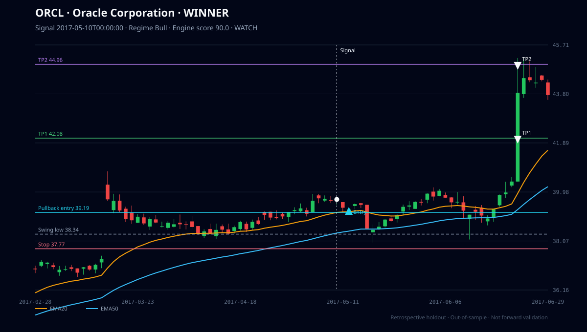

| Field | Audited value |
| --- | --- |
| Signal date / data timestamp | 2017-05-10 / `2017-05-10T00:00:00` |
| Market regime | Bull · engine 90 · The benchmark regime is risk-on based on 50/200-day EMA alignment. |
| Confidence / recommendation | 68 / WATCH |
| Signal price | 39.691864 |
| Proposed EMA20 pullback / expected fill | 39.187527 / 39.207121 |
| Actual entry | 2017-05-12 / 39.207121 |
| Swing low / stop | 38.340623 / 37.769342 |
| TP1 / TP2 | 42.082678 / 44.958236 |
| £10,000 position size | 69 shares · £2705.29 value |
| Maximum monetary risk | £99.21 of £100.00 budget |
| Holding period | 29 completed candles |
| Costs / slippage | £2.85 / £2.85 |
| Final result / normalized source ledger | 2.970582R / £294.70 / 2.956104R |
| MFE / MAE | 4.169184R / -0.833071R |
| Rejection or expiry reason | Not applicable |

### Qualification audit

- Signal calculations used completed daily candles ending 2017-05-10; no later candle was supplied to the analysis engines.
- Signal-time EMA20 was 39.187527; the frozen entry window was 3 completed sessions.
- Signal-time ATR was 0.380854 and the 20-session swing low was 38.340623.
- Institutional market-regime score 90 met the frozen >=65 long-entry gate.
- The EMA20 limit traded on 2017-05-12, session 2 of 3.
- Stop 37.769342 was below executable fill 39.207121.
- Per-share risk was 3.6671% of entry, within the frozen 5% maximum.
- No same-ticker position overlapped this accepted entry.

### £10,000 account exit legs

| Leg | Date | Shares | Reference | Fill | Net P/L | R contribution |
| --- | --- | ---: | ---: | ---: | ---: | ---: |
| TP1 | 2017-06-22 | 34 | 42.082678 | 42.061637 | £95.67 | 0.964370R |
| TP2 | 2017-06-22 | 35 | 44.958236 | 44.935756 | £199.03 | 2.006212R |

Audit checks: **19/19 passed**. Raw source: [`ORCL.csv`](../artifacts/trade_evidence/raw/ORCL.csv).

## E02 Winner: TMO

**Thermo Fisher Scientific Inc. · Health Care**

**Classification:** RETROSPECTIVE HOLDOUT · OUT-OF-SAMPLE · NOT FORWARD VALIDATION

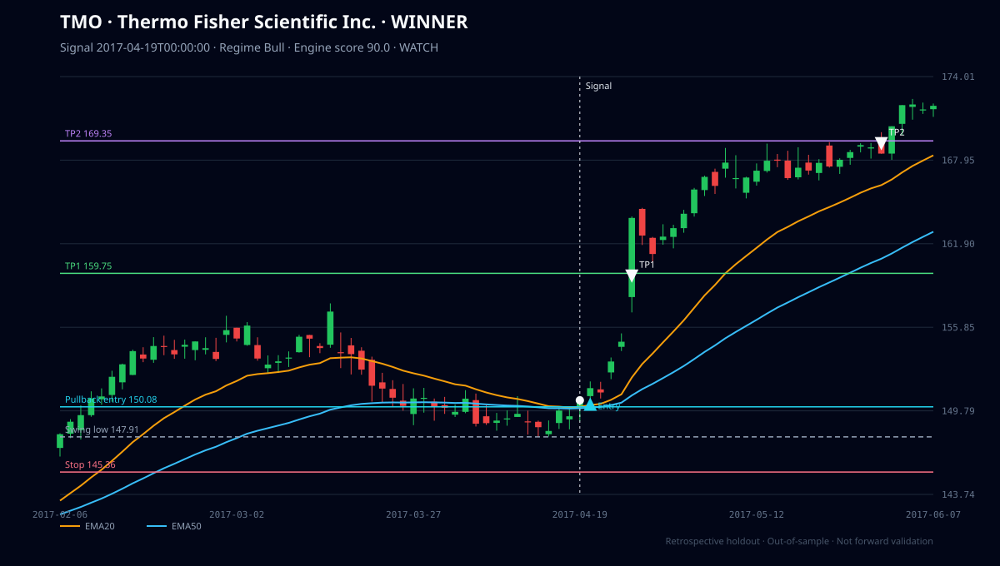

| Field | Audited value |
| --- | --- |
| Signal date / data timestamp | 2017-04-19 / `2017-04-19T00:00:00` |
| Market regime | Bull · engine 90 · The benchmark regime is risk-on based on 50/200-day EMA alignment. |
| Confidence / recommendation | 70 / WATCH |
| Signal price | 150.560593 |
| Proposed EMA20 pullback / expected fill | 150.084593 / 150.159635 |
| Actual entry | 2017-04-20 / 150.159635 |
| Swing low / stop | 147.909275 / 145.362512 |
| TP1 / TP2 | 159.753881 / 169.348127 |
| £10,000 position size | 20 shares · £3003.19 value |
| Maximum monetary risk | £95.94 of £100.00 budget |
| Holding period | 29 completed candles |
| Costs / slippage | £3.15 / £3.15 |
| Final result / normalized source ledger | 2.950056R / £283.04 / 2.950056R |
| MFE / MAE | 4.131233R / -0.046472R |
| Rejection or expiry reason | Not applicable |

### Qualification audit

- Signal calculations used completed daily candles ending 2017-04-19; no later candle was supplied to the analysis engines.
- Signal-time EMA20 was 150.084593; the frozen entry window was 3 completed sessions.
- Signal-time ATR was 1.697842 and the 20-session swing low was 147.909275.
- Institutional market-regime score 90 met the frozen >=65 long-entry gate.
- The EMA20 limit traded on 2017-04-20, session 1 of 3.
- Stop 145.362512 was below executable fill 150.159635.
- Per-share risk was 3.1947% of entry, within the frozen 5% maximum.
- No same-ticker position overlapped this accepted entry.

### £10,000 account exit legs

| Leg | Date | Shares | Reference | Fill | Net P/L | R contribution |
| --- | --- | ---: | ---: | ---: | ---: | ---: |
| TP1 | 2017-04-26 | 10 | 159.753881 | 159.674004 | £93.59 | 0.975528R |
| TP2 | 2017-05-31 | 10 | 169.348127 | 169.263453 | £189.44 | 1.974528R |

Audit checks: **19/19 passed**. Raw source: [`TMO.csv`](../artifacts/trade_evidence/raw/TMO.csv).

## E03 Winner: LOW

**Lowe's Companies, Inc. · Consumer Discretionary**

**Classification:** RETROSPECTIVE HOLDOUT · OUT-OF-SAMPLE · NOT FORWARD VALIDATION

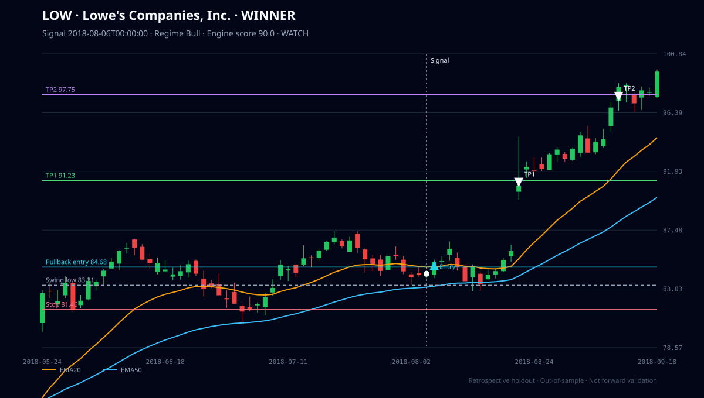

| Field | Audited value |
| --- | --- |
| Signal date / data timestamp | 2018-08-06 / `2018-08-06T00:00:00` |
| Market regime | Bull · engine 90 · The benchmark regime is risk-on based on 50/200-day EMA alignment. |
| Confidence / recommendation | 73 / WATCH |
| Signal price | 84.175301 |
| Proposed EMA20 pullback / expected fill | 84.676455 / 84.718793 |
| Actual entry | 2018-08-07 / 84.718793 |
| Swing low / stop | 83.305539 / 81.461264 |
| TP1 / TP2 | 91.233852 / 97.748910 |
| £10,000 position size | 30 shares · £2541.56 value |
| Maximum monetary risk | £97.73 of £100.00 budget |
| Holding period | 25 completed candles |
| Costs / slippage | £2.69 / £2.69 |
| Final result / normalized source ledger | 2.957997R / £289.07 / 2.957997R |
| MFE / MAE | 4.268948R / -0.566015R |
| Rejection or expiry reason | Not applicable |

### Qualification audit

- Signal calculations used completed daily candles ending 2018-08-06; no later candle was supplied to the analysis engines.
- Signal-time EMA20 was 84.676455; the frozen entry window was 3 completed sessions.
- Signal-time ATR was 1.229517 and the 20-session swing low was 83.305539.
- Institutional market-regime score 90 met the frozen >=65 long-entry gate.
- The EMA20 limit traded on 2018-08-07, session 1 of 3.
- Stop 81.461264 was below executable fill 84.718793.
- Per-share risk was 3.8451% of entry, within the frozen 5% maximum.
- No same-ticker position overlapped this accepted entry.

### £10,000 account exit legs

| Leg | Date | Shares | Reference | Fill | Net P/L | R contribution |
| --- | --- | ---: | ---: | ---: | ---: | ---: |
| TP1 | 2018-08-22 | 15 | 91.233852 | 91.188235 | £95.72 | 0.979498R |
| TP2 | 2018-09-11 | 15 | 97.748910 | 97.700036 | £193.35 | 1.978498R |

Audit checks: **19/19 passed**. Raw source: [`LOW.csv`](../artifacts/trade_evidence/raw/LOW.csv).

## E04 Winner: BLK

**BlackRock, Inc. · Financials**

**Classification:** RETROSPECTIVE HOLDOUT · OUT-OF-SAMPLE · NOT FORWARD VALIDATION

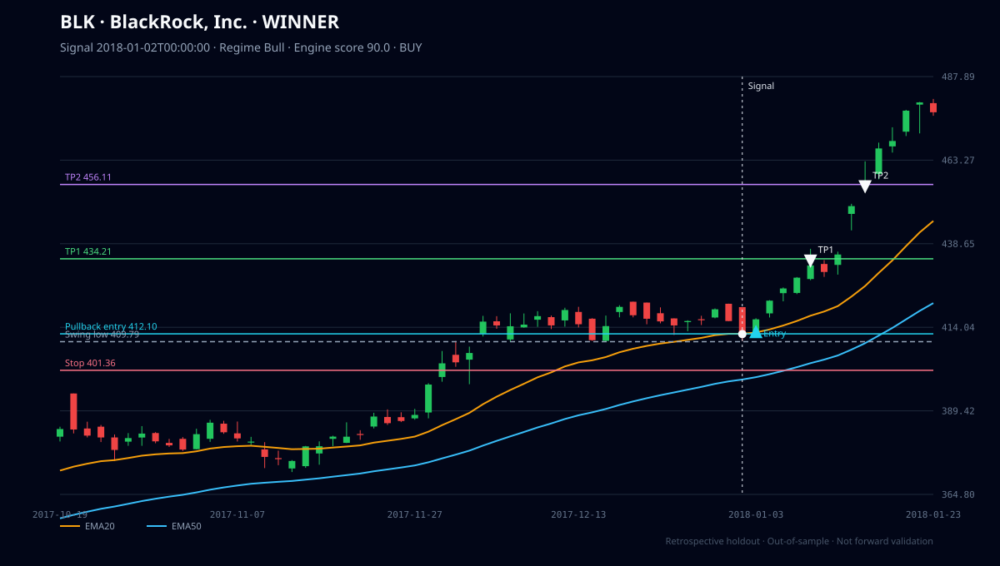

| Field | Audited value |
| --- | --- |
| Signal date / data timestamp | 2018-01-02 / `2018-01-02T00:00:00` |
| Market regime | Bull · engine 90 · The benchmark regime is risk-on based on 50/200-day EMA alignment. |
| Confidence / recommendation | 81 / BUY |
| Signal price | 412.035309 |
| Proposed EMA20 pullback / expected fill | 412.102944 / 412.308996 |
| Actual entry | 2018-01-03 / 412.308996 |
| Swing low / stop | 409.792907 / 401.359862 |
| TP1 / TP2 | 434.207263 / 456.105531 |
| £10,000 position size | 9 shares · £3710.78 value |
| Maximum monetary risk | £98.54 of £100.00 budget |
| Holding period | 9 completed candles |
| Costs / slippage | £3.86 / £3.86 |
| Final result / normalized source ledger | 3.051525R / £300.70 / 2.940525R |
| MFE / MAE | 4.621954R / -0.084891R |
| Rejection or expiry reason | Not applicable |

### Qualification audit

- Signal calculations used completed daily candles ending 2018-01-02; no later candle was supplied to the analysis engines.
- Signal-time EMA20 was 412.102944; the frozen entry window was 3 completed sessions.
- Signal-time ATR was 5.622030 and the 20-session swing low was 409.792907.
- Institutional market-regime score 90 met the frozen >=65 long-entry gate.
- The EMA20 limit traded on 2018-01-03, session 1 of 3.
- Stop 401.359862 was below executable fill 412.308996.
- Per-share risk was 2.6556% of entry, within the frozen 5% maximum.
- No same-ticker position overlapped this accepted entry.

### £10,000 account exit legs

| Leg | Date | Shares | Reference | Fill | Net P/L | R contribution |
| --- | --- | ---: | ---: | ---: | ---: | ---: |
| TP1 | 2018-01-09 | 4 | 434.207263 | 433.990160 | £85.03 | 0.862900R |
| TP2 | 2018-01-16 | 5 | 456.105531 | 455.877478 | £215.67 | 2.188625R |

Audit checks: **19/19 passed**. Raw source: [`BLK.csv`](../artifacts/trade_evidence/raw/BLK.csv).

## E05 Winner: COST

**Costco Wholesale Corporation · Consumer Staples**

**Classification:** RETROSPECTIVE HOLDOUT · OUT-OF-SAMPLE · NOT FORWARD VALIDATION

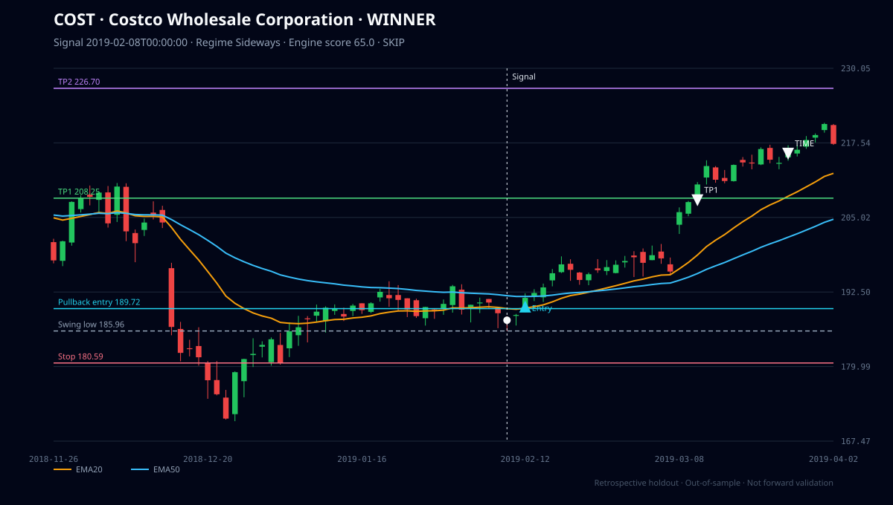

| Field | Audited value |
| --- | --- |
| Signal date / data timestamp | 2019-02-08 / `2019-02-08T00:00:00` |
| Market regime | Sideways · engine 65 · The benchmark regime is risk-on based on 50/200-day EMA alignment. |
| Confidence / recommendation | 53 / SKIP |
| Signal price | 187.769318 |
| Proposed EMA20 pullback / expected fill | 189.715341 / 189.810199 |
| Actual entry | 2019-02-12 / 189.810199 |
| Swing low / stop | 185.961671 / 180.588037 |
| TP1 / TP2 | 208.254523 / 226.698846 |
| £10,000 position size | 10 shares · £1898.10 value |
| Maximum monetary risk | £92.22 of £100.00 budget |
| Holding period | 30 completed candles |
| Costs / slippage | £2.01 / £2.01 |
| Final result / normalized source ledger | 2.390826R / £220.49 / 2.390826R |
| MFE / MAE | 2.972699R / -0.073311R |
| Rejection or expiry reason | Not applicable |

### Qualification audit

- Signal calculations used completed daily candles ending 2019-02-08; no later candle was supplied to the analysis engines.
- Signal-time EMA20 was 189.715341; the frozen entry window was 3 completed sessions.
- Signal-time ATR was 3.582423 and the 20-session swing low was 185.961671.
- Institutional market-regime score 65 met the frozen >=65 long-entry gate.
- The EMA20 limit traded on 2019-02-12, session 2 of 3.
- Stop 180.588037 was below executable fill 189.810199.
- Per-share risk was 4.8586% of entry, within the frozen 5% maximum.
- No same-ticker position overlapped this accepted entry.

### £10,000 account exit legs

| Leg | Date | Shares | Reference | Fill | Net P/L | R contribution |
| --- | --- | ---: | ---: | ---: | ---: | ---: |
| TP1 | 2019-03-12 | 5 | 208.254523 | 208.150395 | £90.71 | 0.983566R |
| TIME | 2019-03-26 | 5 | 216.077087 | 215.969049 | £129.78 | 1.407260R |

Audit checks: **19/19 passed**. Raw source: [`COST.csv`](../artifacts/trade_evidence/raw/COST.csv).

## E06 Winner: WELL

**Welltower Inc. · Real Estate**

**Classification:** RETROSPECTIVE HOLDOUT · OUT-OF-SAMPLE · NOT FORWARD VALIDATION

| Field | Audited value |
| --- | --- |
| Signal date / data timestamp | 2019-02-22 / `2019-02-22T00:00:00` |
| Market regime | Sideways · engine 65 · The benchmark regime is risk-on based on 50/200-day EMA alignment. |
| Confidence / recommendation | 73 / WATCH |
| Signal price | 60.598927 |
| Proposed EMA20 pullback / expected fill | 60.345870 / 60.376043 |
| Actual entry | 2019-02-25 / 60.376043 |
| Swing low / stop | 58.894485 / 57.367793 |
| TP1 / TP2 | 66.392542 / 72.409041 |
| £10,000 position size | 33 shares · £1992.41 value |
| Maximum monetary risk | £99.27 of £100.00 budget |
| Holding period | 30 completed candles |
| Costs / slippage | £2.01 / £2.01 |
| Final result / normalized source ledger | 0.390695R / £38.79 / 0.390695R |
| MFE / MAE | 1.134168R / -0.678922R |
| Rejection or expiry reason | Not applicable |

### Qualification audit

- Signal calculations used completed daily candles ending 2019-02-22; no later candle was supplied to the analysis engines.
- Signal-time EMA20 was 60.345870; the frozen entry window was 3 completed sessions.
- Signal-time ATR was 1.017795 and the 20-session swing low was 58.894485.
- Institutional market-regime score 65 met the frozen >=65 long-entry gate.
- The EMA20 limit traded on 2019-02-25, session 1 of 3.
- Stop 57.367793 was below executable fill 60.376043.
- Per-share risk was 4.9825% of entry, within the frozen 5% maximum.
- No same-ticker position overlapped this accepted entry.

### £10,000 account exit legs

| Leg | Date | Shares | Reference | Fill | Net P/L | R contribution |
| --- | --- | ---: | ---: | ---: | ---: | ---: |
| TIME | 2019-04-05 | 33 | 61.643166 | 61.612344 | £38.79 | 0.390695R |

Audit checks: **19/19 passed**. Raw source: [`WELL.csv`](../artifacts/trade_evidence/raw/WELL.csv).

## E07 Winner: NEM

**Newmont Corporation · Materials**

**Classification:** RETROSPECTIVE HOLDOUT · OUT-OF-SAMPLE · NOT FORWARD VALIDATION

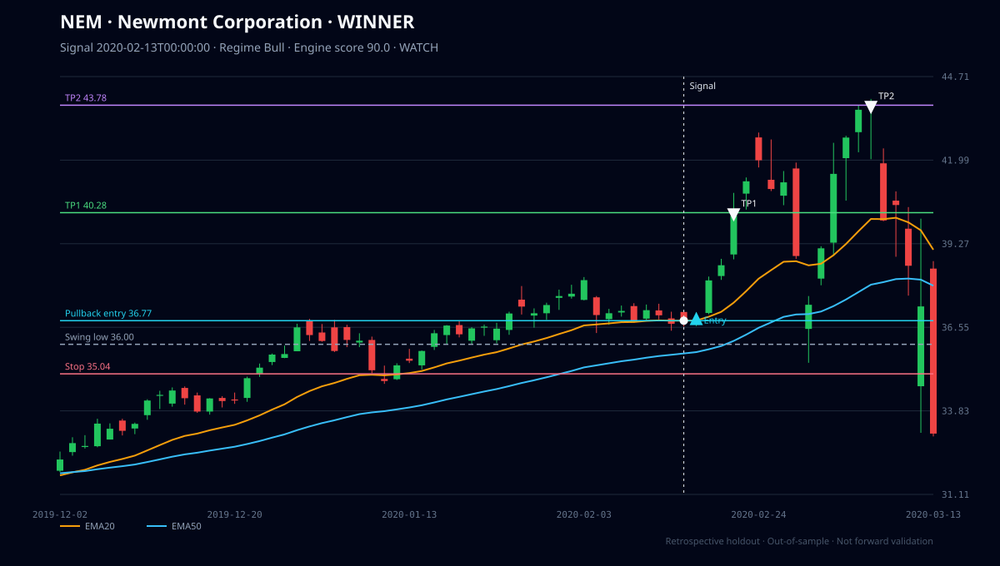

| Field | Audited value |
| --- | --- |
| Signal date / data timestamp | 2020-02-13 / `2020-02-13T00:00:00` |
| Market regime | Bull · engine 90 · The benchmark regime is risk-on based on 50/200-day EMA alignment. |
| Confidence / recommendation | 71 / WATCH |
| Signal price | 36.766987 |
| Proposed EMA20 pullback / expected fill | 36.767260 / 36.785644 |
| Actual entry | 2020-02-14 / 36.785644 |
| Swing low / stop | 35.998396 / 35.036996 |
| TP1 / TP2 | 40.282940 / 43.780237 |
| £10,000 position size | 57 shares · £2096.78 value |
| Maximum monetary risk | £99.67 of £100.00 budget |
| Holding period | 15 completed candles |
| Costs / slippage | £2.25 / £2.25 |
| Final result / normalized source ledger | 2.982977R / £297.32 / 2.965451R |
| MFE / MAE | 4.116274R / -0.794182R |
| Rejection or expiry reason | Not applicable |

### Qualification audit

- Signal calculations used completed daily candles ending 2020-02-13; no later candle was supplied to the analysis engines.
- Signal-time EMA20 was 36.767260; the frozen entry window was 3 completed sessions.
- Signal-time ATR was 0.640933 and the 20-session swing low was 35.998396.
- Institutional market-regime score 90 met the frozen >=65 long-entry gate.
- The EMA20 limit traded on 2020-02-14, session 1 of 3.
- Stop 35.036996 was below executable fill 36.785644.
- Per-share risk was 4.7536% of entry, within the frozen 5% maximum.
- No same-ticker position overlapped this accepted entry.

### £10,000 account exit legs

| Leg | Date | Shares | Reference | Fill | Net P/L | R contribution |
| --- | --- | ---: | ---: | ---: | ---: | ---: |
| TP1 | 2020-02-20 | 28 | 40.282940 | 40.262799 | £96.28 | 0.965976R |
| TP2 | 2020-03-06 | 29 | 43.780237 | 43.758347 | £201.04 | 2.017002R |

Audit checks: **19/19 passed**. Raw source: [`NEM.csv`](../artifacts/trade_evidence/raw/NEM.csv).

## E08 Winner: ABT

**Abbott Laboratories · Health Care**

**Classification:** RETROSPECTIVE HOLDOUT · OUT-OF-SAMPLE · NOT FORWARD VALIDATION

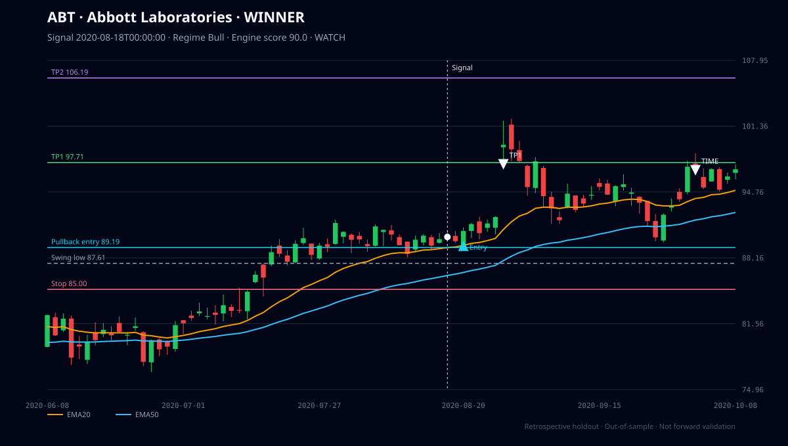

| Field | Audited value |
| --- | --- |
| Signal date / data timestamp | 2020-08-18 / `2020-08-18T00:00:00` |
| Market regime | Bull · engine 90 · The benchmark regime is risk-on based on 50/200-day EMA alignment. |
| Confidence / recommendation | 70 / WATCH |
| Signal price | 90.257324 |
| Proposed EMA20 pullback / expected fill | 89.194819 / 89.239416 |
| Actual entry | 2020-08-20 / 89.239416 |
| Swing low / stop | 87.611127 / 85.002592 |
| TP1 / TP2 | 97.713064 / 106.186711 |
| £10,000 position size | 23 shares · £2052.51 value |
| Maximum monetary risk | £97.45 of £100.00 budget |
| Holding period | 30 completed candles |
| Costs / slippage | £2.15 / £2.15 |
| Final result / normalized source ledger | 1.893846R / £184.55 / 1.896870R |
| MFE / MAE | 3.033962R / -0.015059R |
| Rejection or expiry reason | Not applicable |

### Qualification audit

- Signal calculations used completed daily candles ending 2020-08-18; no later candle was supplied to the analysis engines.
- Signal-time EMA20 was 89.194819; the frozen entry window was 3 completed sessions.
- Signal-time ATR was 1.739023 and the 20-session swing low was 87.611127.
- Institutional market-regime score 90 met the frozen >=65 long-entry gate.
- The EMA20 limit traded on 2020-08-20, session 2 of 3.
- Stop 85.002592 was below executable fill 89.239416.
- Per-share risk was 4.7477% of entry, within the frozen 5% maximum.
- No same-ticker position overlapped this accepted entry.

### £10,000 account exit legs

| Leg | Date | Shares | Reference | Fill | Net P/L | R contribution |
| --- | --- | ---: | ---: | ---: | ---: | ---: |
| TP1 | 2020-08-27 | 11 | 97.713064 | 97.664207 | £91.64 | 0.940458R |
| TIME | 2020-10-01 | 12 | 97.123199 | 97.074638 | £92.90 | 0.953388R |

Audit checks: **19/19 passed**. Raw source: [`ABT.csv`](../artifacts/trade_evidence/raw/ABT.csv).

## E09 Winner: PSA

**Public Storage · Real Estate**

**Classification:** RETROSPECTIVE HOLDOUT · OUT-OF-SAMPLE · NOT FORWARD VALIDATION

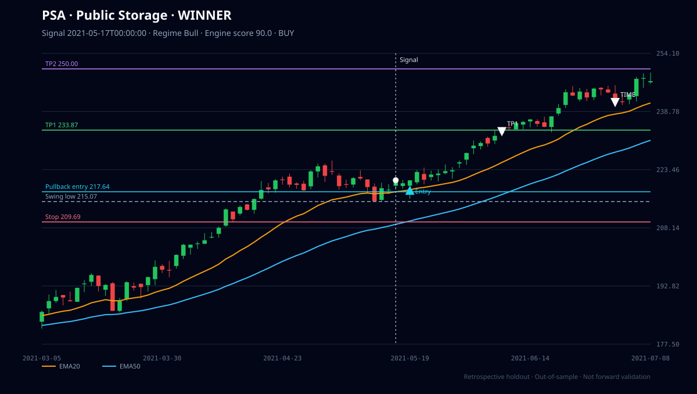

| Field | Audited value |
| --- | --- |
| Signal date / data timestamp | 2021-05-17 / `2021-05-17T00:00:00` |
| Market regime | Bull · engine 90 · The benchmark regime is risk-on based on 50/200-day EMA alignment. |
| Confidence / recommendation | 76 / BUY |
| Signal price | 220.678329 |
| Proposed EMA20 pullback / expected fill | 217.644478 / 217.753300 |
| Actual entry | 2021-05-19 / 217.753300 |
| Swing low / stop | 215.069159 / 209.692848 |
| TP1 / TP2 | 233.874206 / 249.995111 |
| £10,000 position size | 12 shares · £2613.04 value |
| Maximum monetary risk | £96.73 of £100.00 budget |
| Holding period | 30 completed candles |
| Costs / slippage | £2.73 / £2.73 |
| Final result / normalized source ledger | 2.433050R / £235.34 / 2.433050R |
| MFE / MAE | 3.466334R / -0.245888R |
| Rejection or expiry reason | Not applicable |

### Qualification audit

- Signal calculations used completed daily candles ending 2021-05-17; no later candle was supplied to the analysis engines.
- Signal-time EMA20 was 217.644478; the frozen entry window was 3 completed sessions.
- Signal-time ATR was 3.584208 and the 20-session swing low was 215.069159.
- Institutional market-regime score 90 met the frozen >=65 long-entry gate.
- The EMA20 limit traded on 2021-05-19, session 2 of 3.
- Stop 209.692848 was below executable fill 217.753300.
- Per-share risk was 3.7016% of entry, within the frozen 5% maximum.
- No same-ticker position overlapped this accepted entry.

### £10,000 account exit legs

| Leg | Date | Shares | Reference | Fill | Net P/L | R contribution |
| --- | --- | ---: | ---: | ---: | ---: | ---: |
| TP1 | 2021-06-08 | 6 | 233.874206 | 233.757269 | £94.67 | 0.978742R |
| TIME | 2021-06-30 | 6 | 241.548416 | 241.427642 | £140.67 | 1.454307R |

Audit checks: **19/19 passed**. Raw source: [`PSA.csv`](../artifacts/trade_evidence/raw/PSA.csv).

## E10 Winner: DUK

**Duke Energy Corporation · Utilities**

**Classification:** RETROSPECTIVE HOLDOUT · OUT-OF-SAMPLE · NOT FORWARD VALIDATION

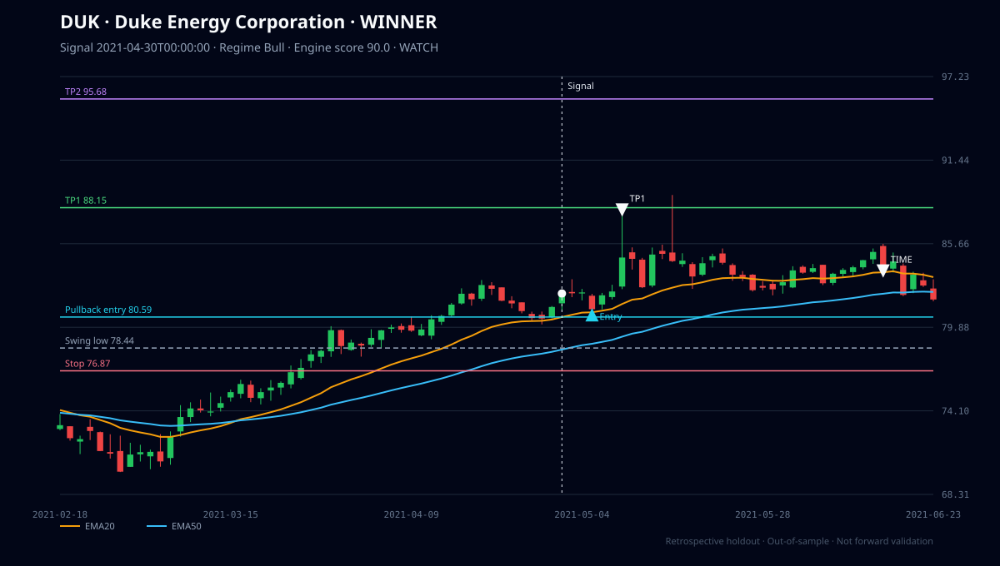

| Field | Audited value |
| --- | --- |
| Signal date / data timestamp | 2021-04-30 / `2021-04-30T00:00:00` |
| Market regime | Bull · engine 90 · The benchmark regime is risk-on based on 50/200-day EMA alignment. |
| Confidence / recommendation | 67 / WATCH |
| Signal price | 82.215164 |
| Proposed EMA20 pullback / expected fill | 80.587743 / 80.628036 |
| Actual entry | 2021-05-05 / 80.628036 |
| Swing low / stop | 78.442841 / 76.865380 |
| TP1 / TP2 | 88.153349 / 95.678661 |
| £10,000 position size | 26 shares · £2096.33 value |
| Maximum monetary risk | £97.83 of £100.00 budget |
| Holding period | 30 completed candles |
| Costs / slippage | £2.17 / £2.17 |
| Final result / normalized source ledger | 1.405183R / £137.47 / 1.405183R |
| MFE / MAE | 2.233711R / -0.020881R |
| Rejection or expiry reason | Not applicable |

### Qualification audit

- Signal calculations used completed daily candles ending 2021-04-30; no later candle was supplied to the analysis engines.
- Signal-time EMA20 was 80.587743; the frozen entry window was 3 completed sessions.
- Signal-time ATR was 1.051641 and the 20-session swing low was 78.442841.
- Institutional market-regime score 90 met the frozen >=65 long-entry gate.
- The EMA20 limit traded on 2021-05-05, session 3 of 3.
- Stop 76.865380 was below executable fill 80.628036.
- Per-share risk was 4.6667% of entry, within the frozen 5% maximum.
- No same-ticker position overlapped this accepted entry.

### £10,000 account exit legs

| Leg | Date | Shares | Reference | Fill | Net P/L | R contribution |
| --- | --- | ---: | ---: | ---: | ---: | ---: |
| TP1 | 2021-05-10 | 13 | 88.153349 | 88.109272 | £96.16 | 0.982932R |
| TIME | 2021-06-16 | 13 | 83.929832 | 83.887868 | £41.31 | 0.422251R |

Audit checks: **19/19 passed**. Raw source: [`DUK.csv`](../artifacts/trade_evidence/raw/DUK.csv).

## E11 Loser: CL

**Colgate-Palmolive Company · Consumer Staples**

**Classification:** RETROSPECTIVE HOLDOUT · OUT-OF-SAMPLE · NOT FORWARD VALIDATION

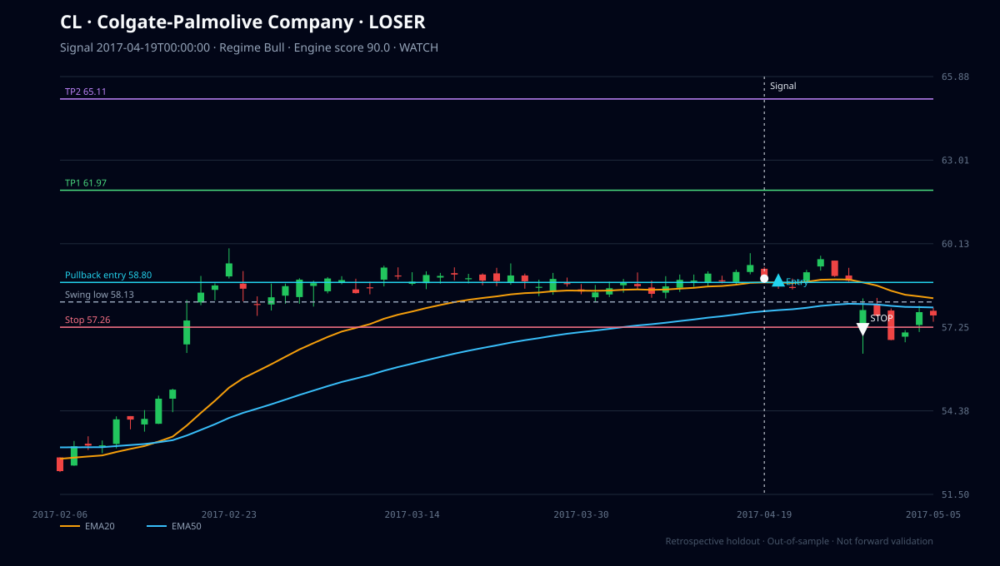

| Field | Audited value |
| --- | --- |
| Signal date / data timestamp | 2017-04-19 / `2017-04-19T00:00:00` |
| Market regime | Bull · engine 90 · The benchmark regime is risk-on based on 50/200-day EMA alignment. |
| Confidence / recommendation | 74 / WATCH |
| Signal price | 58.930176 |
| Proposed EMA20 pullback / expected fill | 58.798154 / 58.827553 |
| Actual entry | 2017-04-20 / 58.827553 |
| Swing low / stop | 58.126040 / 57.256665 |
| TP1 / TP2 | 61.969329 / 65.111105 |
| £10,000 position size | 63 shares · £3706.14 value |
| Maximum monetary risk | £98.97 of £100.00 budget |
| Holding period | 7 completed candles |
| Costs / slippage | £3.66 / £3.66 |
| Final result / normalized source ledger | -1.055164R / £-104.43 / -1.055164R |
| MFE / MAE | 0.566268R / -1.580601R |
| Rejection or expiry reason | Not applicable |

### Qualification audit

- Signal calculations used completed daily candles ending 2017-04-19; no later candle was supplied to the analysis engines.
- Signal-time EMA20 was 58.798154; the frozen entry window was 3 completed sessions.
- Signal-time ATR was 0.579583 and the 20-session swing low was 58.126040.
- Institutional market-regime score 90 met the frozen >=65 long-entry gate.
- The EMA20 limit traded on 2017-04-20, session 1 of 3.
- Stop 57.256665 was below executable fill 58.827553.
- Per-share risk was 2.6703% of entry, within the frozen 5% maximum.
- No same-ticker position overlapped this accepted entry.

### £10,000 account exit legs

| Leg | Date | Shares | Reference | Fill | Net P/L | R contribution |
| --- | --- | ---: | ---: | ---: | ---: | ---: |
| STOP | 2017-04-28 | 63 | 57.256665 | 57.228037 | £-104.43 | -1.055164R |

Audit checks: **19/19 passed**. Raw source: [`CL.csv`](../artifacts/trade_evidence/raw/CL.csv).

## E12 Loser: XOM

**Exxon Mobil Corporation · Energy**

**Classification:** RETROSPECTIVE HOLDOUT · OUT-OF-SAMPLE · NOT FORWARD VALIDATION

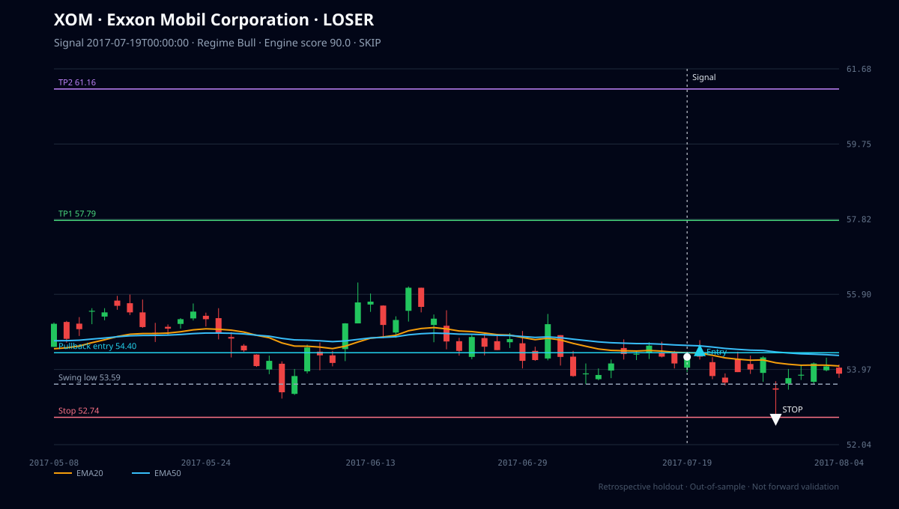

| Field | Audited value |
| --- | --- |
| Signal date / data timestamp | 2017-07-19 / `2017-07-19T00:00:00` |
| Market regime | Bull · engine 90 · The benchmark regime is risk-on based on 50/200-day EMA alignment. |
| Confidence / recommendation | 54 / SKIP |
| Signal price | 54.291561 |
| Proposed EMA20 pullback / expected fill | 54.399366 / 54.426565 |
| Actual entry | 2017-07-20 / 54.426565 |
| Swing low / stop | 53.593182 / 52.743288 |
| TP1 / TP2 | 57.793119 / 61.159673 |
| £10,000 position size | 59 shares · £3211.17 value |
| Maximum monetary risk | £99.31 of £100.00 budget |
| Holding period | 7 completed candles |
| Costs / slippage | £3.16 / £3.16 |
| Final result / normalized source ledger | -1.047493R / £-104.03 / -1.047493R |
| MFE / MAE | 0.175122R / -1.109427R |
| Rejection or expiry reason | Not applicable |

### Qualification audit

- Signal calculations used completed daily candles ending 2017-07-19; no later candle was supplied to the analysis engines.
- Signal-time EMA20 was 54.399366; the frozen entry window was 3 completed sessions.
- Signal-time ATR was 0.566596 and the 20-session swing low was 53.593182.
- Institutional market-regime score 90 met the frozen >=65 long-entry gate.
- The EMA20 limit traded on 2017-07-20, session 1 of 3.
- Stop 52.743288 was below executable fill 54.426565.
- Per-share risk was 3.0927% of entry, within the frozen 5% maximum.
- No same-ticker position overlapped this accepted entry.

### £10,000 account exit legs

| Leg | Date | Shares | Reference | Fill | Net P/L | R contribution |
| --- | --- | ---: | ---: | ---: | ---: | ---: |
| STOP | 2017-07-28 | 59 | 52.743288 | 52.716917 | £-104.03 | -1.047493R |

Audit checks: **19/19 passed**. Raw source: [`XOM.csv`](../artifacts/trade_evidence/raw/XOM.csv).

## E13 Loser: SBUX

**Starbucks Corporation · Consumer Discretionary**

**Classification:** RETROSPECTIVE HOLDOUT · OUT-OF-SAMPLE · NOT FORWARD VALIDATION

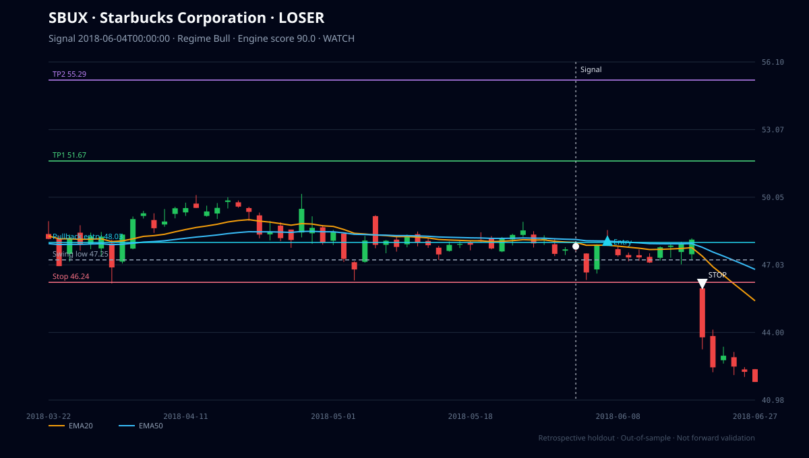

| Field | Audited value |
| --- | --- |
| Signal date / data timestamp | 2018-06-04 / `2018-06-04T00:00:00` |
| Market regime | Bull · engine 90 · The benchmark regime is risk-on based on 50/200-day EMA alignment. |
| Confidence / recommendation | 64 / WATCH |
| Signal price | 47.851238 |
| Proposed EMA20 pullback / expected fill | 48.027645 / 48.051659 |
| Actual entry | 2018-06-07 / 48.051659 |
| Swing low / stop | 47.247525 / 46.243128 |
| TP1 / TP2 | 51.668719 / 55.285779 |
| £10,000 position size | 55 shares · £2642.84 value |
| Maximum monetary risk | £99.47 of £100.00 budget |
| Holding period | 10 completed candles |
| Costs / slippage | £2.59 / £2.59 |
| Final result / normalized source ledger | -1.038848R / £-103.33 / -1.038848R |
| MFE / MAE | 0.292523R / -2.656084R |
| Rejection or expiry reason | Not applicable |

### Qualification audit

- Signal calculations used completed daily candles ending 2018-06-04; no later candle was supplied to the analysis engines.
- Signal-time EMA20 was 48.027645; the frozen entry window was 3 completed sessions.
- Signal-time ATR was 0.669598 and the 20-session swing low was 47.247525.
- Institutional market-regime score 90 met the frozen >=65 long-entry gate.
- The EMA20 limit traded on 2018-06-07, session 3 of 3.
- Stop 46.243128 was below executable fill 48.051659.
- Per-share risk was 3.7637% of entry, within the frozen 5% maximum.
- No same-ticker position overlapped this accepted entry.

### £10,000 account exit legs

| Leg | Date | Shares | Reference | Fill | Net P/L | R contribution |
| --- | --- | ---: | ---: | ---: | ---: | ---: |
| STOP | 2018-06-20 | 55 | 46.243128 | 46.220007 | £-103.33 | -1.038848R |

Audit checks: **19/19 passed**. Raw source: [`SBUX.csv`](../artifacts/trade_evidence/raw/SBUX.csv).

## E14 Loser: JNJ

**Johnson & Johnson · Health Care**

**Classification:** RETROSPECTIVE HOLDOUT · OUT-OF-SAMPLE · NOT FORWARD VALIDATION

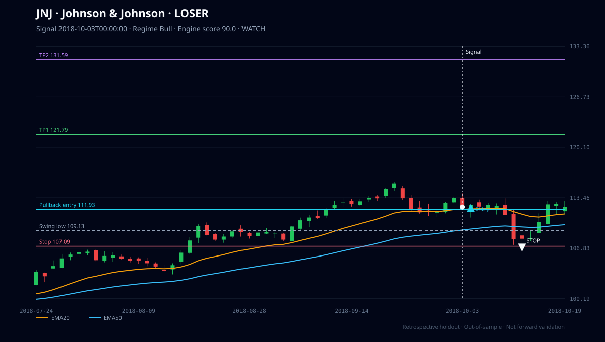

| Field | Audited value |
| --- | --- |
| Signal date / data timestamp | 2018-10-03 / `2018-10-03T00:00:00` |
| Market regime | Bull · engine 90 · The benchmark regime is risk-on based on 50/200-day EMA alignment. |
| Confidence / recommendation | 74 / WATCH |
| Signal price | 112.240723 |
| Proposed EMA20 pullback / expected fill | 111.934606 / 111.990574 |
| Actual entry | 2018-10-04 / 111.990574 |
| Swing low / stop | 109.132572 / 107.091738 |
| TP1 / TP2 | 121.788244 / 131.585915 |
| £10,000 position size | 20 shares · £2239.81 value |
| Maximum monetary risk | £97.98 of £100.00 budget |
| Holding period | 7 completed candles |
| Costs / slippage | £2.19 / £2.19 |
| Final result / normalized source ledger | -1.033286R / £-101.24 / -1.033286R |
| MFE / MAE | 0.286716R / -1.069568R |
| Rejection or expiry reason | Not applicable |

### Qualification audit

- Signal calculations used completed daily candles ending 2018-10-03; no later candle was supplied to the analysis engines.
- Signal-time EMA20 was 111.934606; the frozen entry window was 3 completed sessions.
- Signal-time ATR was 1.360556 and the 20-session swing low was 109.132572.
- Institutional market-regime score 90 met the frozen >=65 long-entry gate.
- The EMA20 limit traded on 2018-10-04, session 1 of 3.
- Stop 107.091738 was below executable fill 111.990574.
- Per-share risk was 4.3743% of entry, within the frozen 5% maximum.
- No same-ticker position overlapped this accepted entry.

### £10,000 account exit legs

| Leg | Date | Shares | Reference | Fill | Net P/L | R contribution |
| --- | --- | ---: | ---: | ---: | ---: | ---: |
| STOP | 2018-10-12 | 20 | 107.091738 | 107.038193 | £-101.24 | -1.033286R |

Audit checks: **19/19 passed**. Raw source: [`JNJ.csv`](../artifacts/trade_evidence/raw/JNJ.csv).

## E15 Loser: KO

**The Coca-Cola Company · Consumer Staples**

**Classification:** RETROSPECTIVE HOLDOUT · OUT-OF-SAMPLE · NOT FORWARD VALIDATION

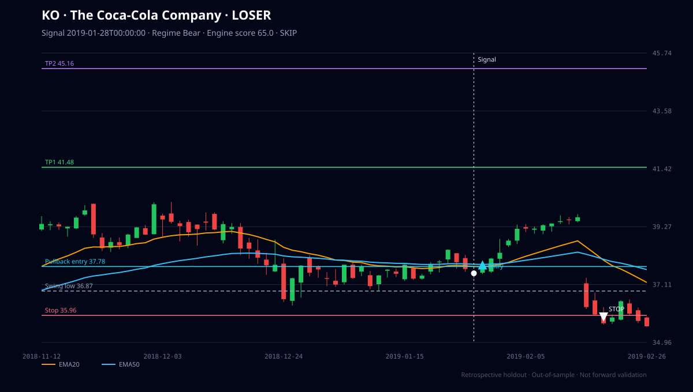

| Field | Audited value |
| --- | --- |
| Signal date / data timestamp | 2019-01-28 / `2019-01-28T00:00:00` |
| Market regime | Bear · engine 65 · The benchmark regime is risk-on based on 50/200-day EMA alignment. |
| Confidence / recommendation | 52 / SKIP |
| Signal price | 37.532562 |
| Proposed EMA20 pullback / expected fill | 37.784797 / 37.803689 |
| Actual entry | 2019-01-29 / 37.803689 |
| Swing low / stop | 36.872144 / 35.964938 |
| TP1 / TP2 | 41.481192 / 45.158694 |
| £10,000 position size | 54 shares · £2041.40 value |
| Maximum monetary risk | £99.29 of £100.00 budget |
| Holding period | 15 completed candles |
| Costs / slippage | £1.99 / £1.99 |
| Final result / normalized source ledger | -1.029834R / £-102.25 / -1.029834R |
| MFE / MAE | 1.051217R / -1.186008R |
| Rejection or expiry reason | Not applicable |

### Qualification audit

- Signal calculations used completed daily candles ending 2019-01-28; no later candle was supplied to the analysis engines.
- Signal-time EMA20 was 37.784797; the frozen entry window was 3 completed sessions.
- Signal-time ATR was 0.604804 and the 20-session swing low was 36.872144.
- Institutional market-regime score 65 met the frozen >=65 long-entry gate.
- The EMA20 limit traded on 2019-01-29, session 1 of 3.
- Stop 35.964938 was below executable fill 37.803689.
- Per-share risk was 4.8639% of entry, within the frozen 5% maximum.
- No same-ticker position overlapped this accepted entry.

### £10,000 account exit legs

| Leg | Date | Shares | Reference | Fill | Net P/L | R contribution |
| --- | --- | ---: | ---: | ---: | ---: | ---: |
| STOP | 2019-02-19 | 54 | 35.964938 | 35.946955 | £-102.25 | -1.029834R |

Audit checks: **19/19 passed**. Raw source: [`KO.csv`](../artifacts/trade_evidence/raw/KO.csv).

## E16 Loser: BAC

**Bank of America Corporation · Financials**

**Classification:** RETROSPECTIVE HOLDOUT · OUT-OF-SAMPLE · NOT FORWARD VALIDATION

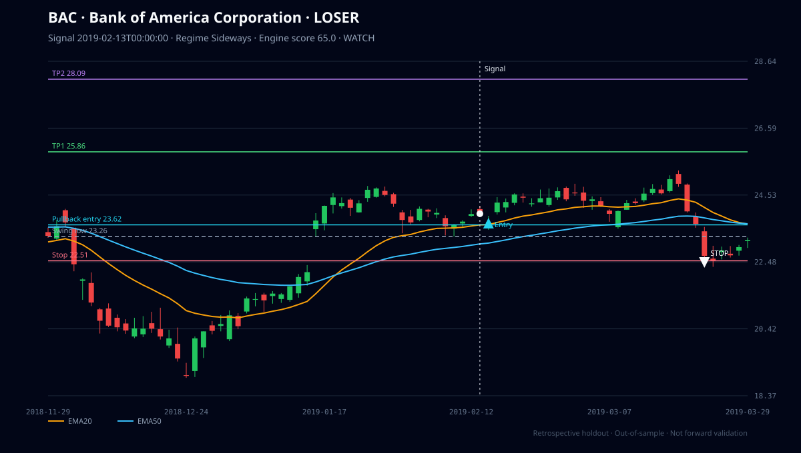

| Field | Audited value |
| --- | --- |
| Signal date / data timestamp | 2019-02-13 / `2019-02-13T00:00:00` |
| Market regime | Sideways · engine 65 · The benchmark regime is risk-on based on 50/200-day EMA alignment. |
| Confidence / recommendation | 65 / WATCH |
| Signal price | 23.959005 |
| Proposed EMA20 pullback / expected fill | 23.617296 / 23.629104 |
| Actual entry | 2019-02-14 / 23.629104 |
| Swing low / stop | 23.257758 / 22.513161 |
| TP1 / TP2 | 25.860992 / 28.092879 |
| £10,000 position size | 89 shares · £2102.99 value |
| Maximum monetary risk | £99.32 of £100.00 budget |
| Holding period | 26 completed candles |
| Costs / slippage | £2.05 / £2.05 |
| Final result / normalized source ledger | -1.030756R / £-102.37 / -1.030756R |
| MFE / MAE | 1.487963R / -1.091031R |
| Rejection or expiry reason | Not applicable |

### Qualification audit

- Signal calculations used completed daily candles ending 2019-02-13; no later candle was supplied to the analysis engines.
- Signal-time EMA20 was 23.617296; the frozen entry window was 3 completed sessions.
- Signal-time ATR was 0.496398 and the 20-session swing low was 23.257758.
- Institutional market-regime score 65 met the frozen >=65 long-entry gate.
- The EMA20 limit traded on 2019-02-14, session 1 of 3.
- Stop 22.513161 was below executable fill 23.629104.
- Per-share risk was 4.7228% of entry, within the frozen 5% maximum.
- No same-ticker position overlapped this accepted entry.

### £10,000 account exit legs

| Leg | Date | Shares | Reference | Fill | Net P/L | R contribution |
| --- | --- | ---: | ---: | ---: | ---: | ---: |
| STOP | 2019-03-22 | 89 | 22.513161 | 22.501904 | £-102.37 | -1.030756R |

Audit checks: **19/19 passed**. Raw source: [`BAC.csv`](../artifacts/trade_evidence/raw/BAC.csv).

## E17 Loser: ITW

**Illinois Tool Works Inc. · Industrials**

**Classification:** RETROSPECTIVE HOLDOUT · OUT-OF-SAMPLE · NOT FORWARD VALIDATION

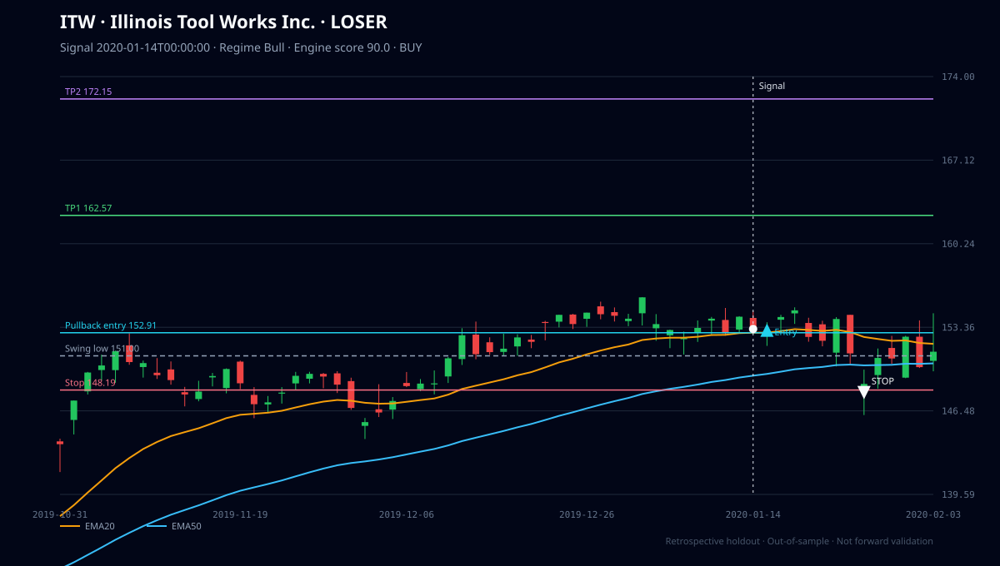

| Field | Audited value |
| --- | --- |
| Signal date / data timestamp | 2020-01-14 / `2020-01-14T00:00:00` |
| Market regime | Bull · engine 90 · The benchmark regime is risk-on based on 50/200-day EMA alignment. |
| Confidence / recommendation | 77 / BUY |
| Signal price | 153.213486 |
| Proposed EMA20 pullback / expected fill | 152.906024 / 152.982477 |
| Actual entry | 2020-01-15 / 152.982477 |
| Swing low / stop | 151.003859 / 148.189559 |
| TP1 / TP2 | 162.568313 / 172.154149 |
| £10,000 position size | 20 shares · £3059.65 value |
| Maximum monetary risk | £95.86 of £100.00 budget |
| Holding period | 8 completed candles |
| Costs / slippage | £3.01 / £3.01 |
| Final result / normalized source ledger | -1.046870R / £-100.35 / -1.046870R |
| MFE / MAE | 0.420400R / -1.429881R |
| Rejection or expiry reason | Not applicable |

### Qualification audit

- Signal calculations used completed daily candles ending 2020-01-14; no later candle was supplied to the analysis engines.
- Signal-time EMA20 was 152.906024; the frozen entry window was 3 completed sessions.
- Signal-time ATR was 1.876200 and the 20-session swing low was 151.003859.
- Institutional market-regime score 90 met the frozen >=65 long-entry gate.
- The EMA20 limit traded on 2020-01-15, session 1 of 3.
- Stop 148.189559 was below executable fill 152.982477.
- Per-share risk was 3.1330% of entry, within the frozen 5% maximum.
- No same-ticker position overlapped this accepted entry.

### £10,000 account exit legs

| Leg | Date | Shares | Reference | Fill | Net P/L | R contribution |
| --- | --- | ---: | ---: | ---: | ---: | ---: |
| STOP | 2020-01-27 | 20 | 148.189559 | 148.115465 | £-100.35 | -1.046870R |

Audit checks: **19/19 passed**. Raw source: [`ITW.csv`](../artifacts/trade_evidence/raw/ITW.csv).

## E18 Loser: IBM

**International Business Machines Corporation · Technology**

**Classification:** RETROSPECTIVE HOLDOUT · OUT-OF-SAMPLE · NOT FORWARD VALIDATION

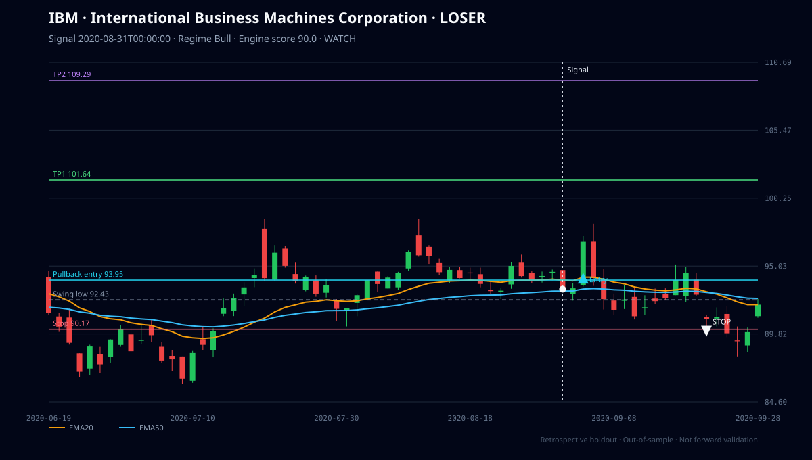

| Field | Audited value |
| --- | --- |
| Signal date / data timestamp | 2020-08-31 / `2020-08-31T00:00:00` |
| Market regime | Bull · engine 90 · The benchmark regime is risk-on based on 50/200-day EMA alignment. |
| Confidence / recommendation | 68 / WATCH |
| Signal price | 93.254127 |
| Proposed EMA20 pullback / expected fill | 93.950716 / 93.997691 |
| Actual entry | 2020-09-02 / 93.997691 |
| Swing low / stop | 92.429600 / 90.174375 |
| TP1 / TP2 | 101.644323 / 109.290954 |
| £10,000 position size | 26 shares · £2443.94 value |
| Maximum monetary risk | £99.41 of £100.00 budget |
| Holding period | 13 completed candles |
| Costs / slippage | £2.39 / £2.39 |
| Final result / normalized source ledger | -1.035872R / £-102.97 / -1.035872R |
| MFE / MAE | 1.118917R / -1.130078R |
| Rejection or expiry reason | Not applicable |

### Qualification audit

- Signal calculations used completed daily candles ending 2020-08-31; no later candle was supplied to the analysis engines.
- Signal-time EMA20 was 93.950716; the frozen entry window was 3 completed sessions.
- Signal-time ATR was 1.503484 and the 20-session swing low was 92.429600.
- Institutional market-regime score 90 met the frozen >=65 long-entry gate.
- The EMA20 limit traded on 2020-09-02, session 2 of 3.
- Stop 90.174375 was below executable fill 93.997691.
- Per-share risk was 4.0675% of entry, within the frozen 5% maximum.
- No same-ticker position overlapped this accepted entry.

### £10,000 account exit legs

| Leg | Date | Shares | Reference | Fill | Net P/L | R contribution |
| --- | --- | ---: | ---: | ---: | ---: | ---: |
| STOP | 2020-09-21 | 26 | 90.174375 | 90.129288 | £-102.97 | -1.035872R |

Audit checks: **19/19 passed**. Raw source: [`IBM.csv`](../artifacts/trade_evidence/raw/IBM.csv).

## E19 Loser: MRK

**Merck & Co., Inc. · Health Care**

**Classification:** RETROSPECTIVE HOLDOUT · OUT-OF-SAMPLE · NOT FORWARD VALIDATION

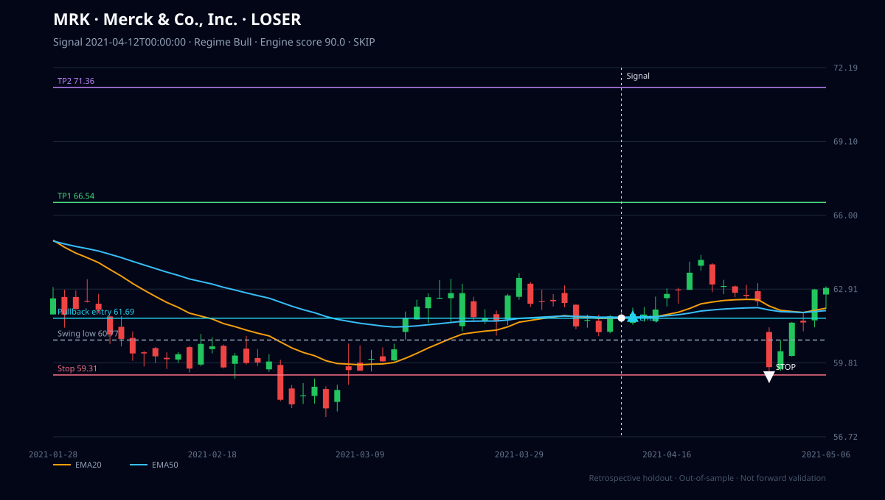

| Field | Audited value |
| --- | --- |
| Signal date / data timestamp | 2021-04-12 / `2021-04-12T00:00:00` |
| Market regime | Bull · engine 90 · The benchmark regime is risk-on based on 50/200-day EMA alignment. |
| Confidence / recommendation | 59 / SKIP |
| Signal price | 61.694973 |
| Proposed EMA20 pullback / expected fill | 61.689233 / 61.720078 |
| Actual entry | 2021-04-13 / 61.720078 |
| Swing low / stop | 60.772224 / 59.308971 |
| TP1 / TP2 | 66.542292 / 71.364505 |
| £10,000 position size | 41 shares · £2530.52 value |
| Maximum monetary risk | £98.86 of £100.00 budget |
| Holding period | 13 completed candles |
| Costs / slippage | £2.48 / £2.48 |
| Final result / normalized source ledger | -1.037391R / £-102.55 / -1.037391R |
| MFE / MAE | 1.087362R / -1.141754R |
| Rejection or expiry reason | Not applicable |

### Qualification audit

- Signal calculations used completed daily candles ending 2021-04-12; no later candle was supplied to the analysis engines.
- Signal-time EMA20 was 61.689233; the frozen entry window was 3 completed sessions.
- Signal-time ATR was 0.975502 and the 20-session swing low was 60.772224.
- Institutional market-regime score 90 met the frozen >=65 long-entry gate.
- The EMA20 limit traded on 2021-04-13, session 1 of 3.
- Stop 59.308971 was below executable fill 61.720078.
- Per-share risk was 3.9065% of entry, within the frozen 5% maximum.
- No same-ticker position overlapped this accepted entry.

### £10,000 account exit legs

| Leg | Date | Shares | Reference | Fill | Net P/L | R contribution |
| --- | --- | ---: | ---: | ---: | ---: | ---: |
| STOP | 2021-04-29 | 41 | 59.308971 | 59.279317 | £-102.55 | -1.037391R |

Audit checks: **19/19 passed**. Raw source: [`MRK.csv`](../artifacts/trade_evidence/raw/MRK.csv).

## E20 Loser: VZ

**Verizon Communications Inc. · Communication Services**

**Classification:** RETROSPECTIVE HOLDOUT · OUT-OF-SAMPLE · NOT FORWARD VALIDATION

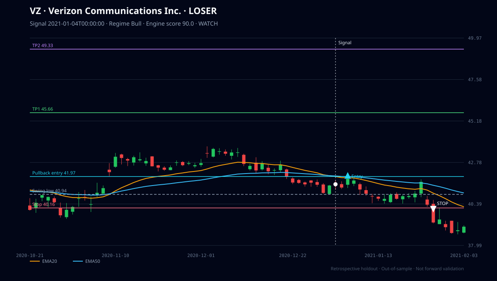

| Field | Audited value |
| --- | --- |
| Signal date / data timestamp | 2021-01-04 / `2021-01-04T00:00:00` |
| Market regime | Bull · engine 90 · The benchmark regime is risk-on based on 50/200-day EMA alignment. |
| Confidence / recommendation | 65 / WATCH |
| Signal price | 41.528046 |
| Proposed EMA20 pullback / expected fill | 41.971791 / 41.992777 |
| Actual entry | 2021-01-06 / 41.992777 |
| Swing low / stop | 40.942343 / 40.158263 |
| TP1 / TP2 | 45.661804 / 49.330831 |
| £10,000 position size | 54 shares · £2267.61 value |
| Maximum monetary risk | £99.06 of £100.00 budget |
| Holding period | 15 completed candles |
| Costs / slippage | £2.22 / £2.22 |
| Final result / normalized source ledger | -1.033330R / £-102.37 / -1.033330R |
| MFE / MAE | 0.012093R / -1.484444R |
| Rejection or expiry reason | Not applicable |

### Qualification audit

- Signal calculations used completed daily candles ending 2021-01-04; no later candle was supplied to the analysis engines.
- Signal-time EMA20 was 41.971791; the frozen entry window was 3 completed sessions.
- Signal-time ATR was 0.522720 and the 20-session swing low was 40.942343.
- Institutional market-regime score 90 met the frozen >=65 long-entry gate.
- The EMA20 limit traded on 2021-01-06, session 2 of 3.
- Stop 40.158263 was below executable fill 41.992777.
- Per-share risk was 4.3686% of entry, within the frozen 5% maximum.
- No same-ticker position overlapped this accepted entry.

### £10,000 account exit legs

| Leg | Date | Shares | Reference | Fill | Net P/L | R contribution |
| --- | --- | ---: | ---: | ---: | ---: | ---: |
| STOP | 2021-01-27 | 54 | 40.158263 | 40.138184 | £-102.37 | -1.033330R |

Audit checks: **19/19 passed**. Raw source: [`VZ.csv`](../artifacts/trade_evidence/raw/VZ.csv).

## E21 Expired: BA

**The Boeing Company · Industrials**

**Classification:** RETROSPECTIVE HOLDOUT · OUT-OF-SAMPLE · NOT FORWARD VALIDATION

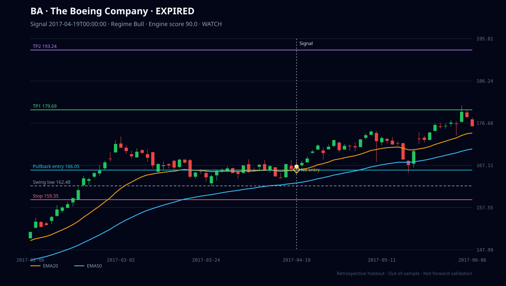

| Field | Audited value |
| --- | --- |
| Signal date / data timestamp | 2017-04-19 / `2017-04-19T00:00:00` |
| Market regime | Bull · engine 90 · The benchmark regime is risk-on based on 50/200-day EMA alignment. |
| Confidence / recommendation | 71 / WATCH |
| Signal price | 166.825104 |
| Proposed EMA20 pullback / expected fill | 166.045902 / 166.128925 |
| Actual entry | Not entered / — |
| Swing low / stop | 162.476828 / 159.350227 |
| TP1 / TP2 | 179.686322 / 193.243719 |
| £10,000 position size | 14 shares · £2325.80 value |
| Maximum monetary risk | £94.90 of £100.00 budget |
| Holding period | 0 completed candles |
| Costs / slippage | £0.00 / £0.00 |
| Final result / normalized source ledger | No trade |
| MFE / MAE | Not applicable — no entry |
| Rejection or expiry reason | Pullback limit was not traded within 3 candles |

### Qualification audit

- Signal calculations used completed daily candles ending 2017-04-19; no later candle was supplied to the analysis engines.
- Signal-time EMA20 was 166.045902; the frozen entry window was 3 completed sessions.
- Signal-time ATR was 2.084401 and the 20-session swing low was 162.476828.
- Institutional market-regime score 90 met the frozen >=65 long-entry gate.
- None of the next 3 raw candles traded through the EMA20 limit; no position was opened.

### £10,000 account exit legs

No exit legs exist because no position was entered.

Audit checks: **13/13 passed**. Raw source: [`BA.csv`](../artifacts/trade_evidence/raw/BA.csv).

## E22 Expired: COP

**ConocoPhillips · Energy**

**Classification:** RETROSPECTIVE HOLDOUT · OUT-OF-SAMPLE · NOT FORWARD VALIDATION

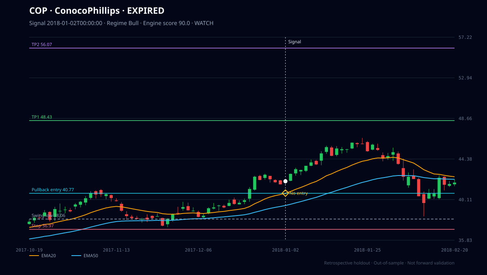

| Field | Audited value |
| --- | --- |
| Signal date / data timestamp | 2018-01-02 / `2018-01-02T00:00:00` |
| Market regime | Bull · engine 90 · The benchmark regime is risk-on based on 50/200-day EMA alignment. |
| Confidence / recommendation | 71 / WATCH |
| Signal price | 42.042461 |
| Proposed EMA20 pullback / expected fill | 40.773199 / 40.793586 |
| Actual entry | Not entered / — |
| Swing low / stop | 38.060155 / 36.974222 |
| TP1 / TP2 | 48.432313 / 56.071040 |
| £10,000 position size | 26 shares · £1060.63 value |
| Maximum monetary risk | £99.30 of £100.00 budget |
| Holding period | 0 completed candles |
| Costs / slippage | £0.00 / £0.00 |
| Final result / normalized source ledger | No trade |
| MFE / MAE | Not applicable — no entry |
| Rejection or expiry reason | Pullback limit was not traded within 3 candles |

### Qualification audit

- Signal calculations used completed daily candles ending 2018-01-02; no later candle was supplied to the analysis engines.
- Signal-time EMA20 was 40.773199; the frozen entry window was 3 completed sessions.
- Signal-time ATR was 0.723955 and the 20-session swing low was 38.060155.
- Institutional market-regime score 90 met the frozen >=65 long-entry gate.
- None of the next 3 raw candles traded through the EMA20 limit; no position was opened.

### £10,000 account exit legs

No exit legs exist because no position was entered.

Audit checks: **13/13 passed**. Raw source: [`COP.csv`](../artifacts/trade_evidence/raw/COP.csv).

## E23 Expired: CHTR

**Charter Communications, Inc. · Communication Services**

**Classification:** RETROSPECTIVE HOLDOUT · OUT-OF-SAMPLE · NOT FORWARD VALIDATION

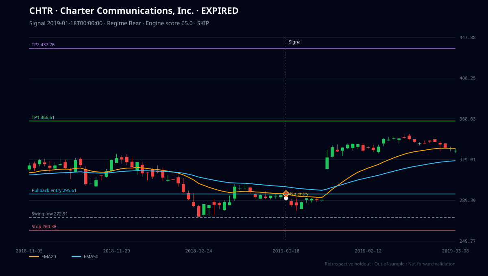

| Field | Audited value |
| --- | --- |
| Signal date / data timestamp | 2019-01-18 / `2019-01-18T00:00:00` |
| Market regime | Bear · engine 65 · The benchmark regime is risk-on based on 50/200-day EMA alignment. |
| Confidence / recommendation | 46 / SKIP |
| Signal price | 291.399994 |
| Proposed EMA20 pullback / expected fill | 295.611656 / 295.759462 |
| Actual entry | Not entered / — |
| Swing low / stop | 272.910004 / 260.383605 |
| TP1 / TP2 | 366.511175 / 437.262889 |
| £10,000 position size | 2 shares · £591.52 value |
| Maximum monetary risk | £70.75 of £100.00 budget |
| Holding period | 0 completed candles |
| Costs / slippage | £0.00 / £0.00 |
| Final result / normalized source ledger | No trade |
| MFE / MAE | Not applicable — no entry |
| Rejection or expiry reason | Pullback limit was not traded within 3 candles |

### Qualification audit

- Signal calculations used completed daily candles ending 2019-01-18; no later candle was supplied to the analysis engines.
- Signal-time EMA20 was 295.611656; the frozen entry window was 3 completed sessions.
- Signal-time ATR was 8.350933 and the 20-session swing low was 272.910004.
- Institutional market-regime score 65 met the frozen >=65 long-entry gate.
- None of the next 3 raw candles traded through the EMA20 limit; no position was opened.

### £10,000 account exit legs

No exit legs exist because no position was entered.

Audit checks: **13/13 passed**. Raw source: [`CHTR.csv`](../artifacts/trade_evidence/raw/CHTR.csv).

## E24 Expired: AEP

**American Electric Power Company, Inc. · Utilities**

**Classification:** RETROSPECTIVE HOLDOUT · OUT-OF-SAMPLE · NOT FORWARD VALIDATION

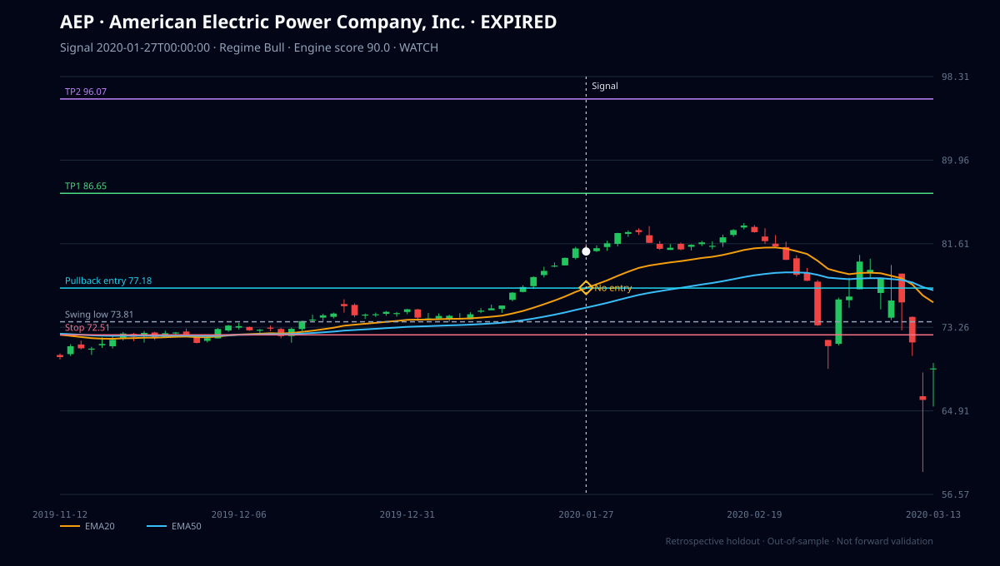

| Field | Audited value |
| --- | --- |
| Signal date / data timestamp | 2020-01-27 / `2020-01-27T00:00:00` |
| Market regime | Bull · engine 90 · The benchmark regime is risk-on based on 50/200-day EMA alignment. |
| Confidence / recommendation | 68 / WATCH |
| Signal price | 80.835876 |
| Proposed EMA20 pullback / expected fill | 77.181462 / 77.220053 |
| Actual entry | Not entered / — |
| Swing low / stop | 73.814955 / 72.506530 |
| TP1 / TP2 | 86.647100 / 96.074147 |
| £10,000 position size | 21 shares · £1621.62 value |
| Maximum monetary risk | £98.98 of £100.00 budget |
| Holding period | 0 completed candles |
| Costs / slippage | £0.00 / £0.00 |
| Final result / normalized source ledger | No trade |
| MFE / MAE | Not applicable — no entry |
| Rejection or expiry reason | Pullback limit was not traded within 3 candles |

### Qualification audit

- Signal calculations used completed daily candles ending 2020-01-27; no later candle was supplied to the analysis engines.
- Signal-time EMA20 was 77.181462; the frozen entry window was 3 completed sessions.
- Signal-time ATR was 0.872284 and the 20-session swing low was 73.814955.
- Institutional market-regime score 90 met the frozen >=65 long-entry gate.
- None of the next 3 raw candles traded through the EMA20 limit; no position was opened.

### £10,000 account exit legs

No exit legs exist because no position was entered.

Audit checks: **13/13 passed**. Raw source: [`AEP.csv`](../artifacts/trade_evidence/raw/AEP.csv).

## E25 Expired: ABBV

**AbbVie Inc. · Health Care**

**Classification:** RETROSPECTIVE HOLDOUT · OUT-OF-SAMPLE · NOT FORWARD VALIDATION

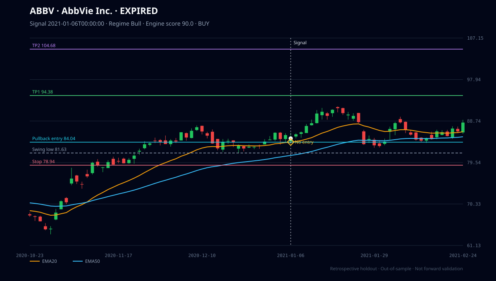

| Field | Audited value |
| --- | --- |
| Signal date / data timestamp | 2021-01-06 / `2021-01-06T00:00:00` |
| Market regime | Bull · engine 90 · The benchmark regime is risk-on based on 50/200-day EMA alignment. |
| Confidence / recommendation | 82 / BUY |
| Signal price | 84.872925 |
| Proposed EMA20 pullback / expected fill | 84.044005 / 84.086027 |
| Actual entry | Not entered / — |
| Swing low / stop | 81.633305 / 78.936912 |
| TP1 / TP2 | 94.384259 / 104.682491 |
| £10,000 position size | 19 shares · £1597.63 value |
| Maximum monetary risk | £97.83 of £100.00 budget |
| Holding period | 0 completed candles |
| Costs / slippage | £0.00 / £0.00 |
| Final result / normalized source ledger | No trade |
| MFE / MAE | Not applicable — no entry |
| Rejection or expiry reason | Pullback limit was not traded within 3 candles |

### Qualification audit

- Signal calculations used completed daily candles ending 2021-01-06; no later candle was supplied to the analysis engines.
- Signal-time EMA20 was 84.044005; the frozen entry window was 3 completed sessions.
- Signal-time ATR was 1.797595 and the 20-session swing low was 81.633305.
- Institutional market-regime score 90 met the frozen >=65 long-entry gate.
- None of the next 3 raw candles traded through the EMA20 limit; no position was opened.

### £10,000 account exit legs

No exit legs exist because no position was entered.

Audit checks: **13/13 passed**. Raw source: [`ABBV.csv`](../artifacts/trade_evidence/raw/ABBV.csv).

## E26 Rejected: AAPL

**Apple Inc. · Technology**

**Classification:** RETROSPECTIVE HOLDOUT · OUT-OF-SAMPLE · NOT FORWARD VALIDATION

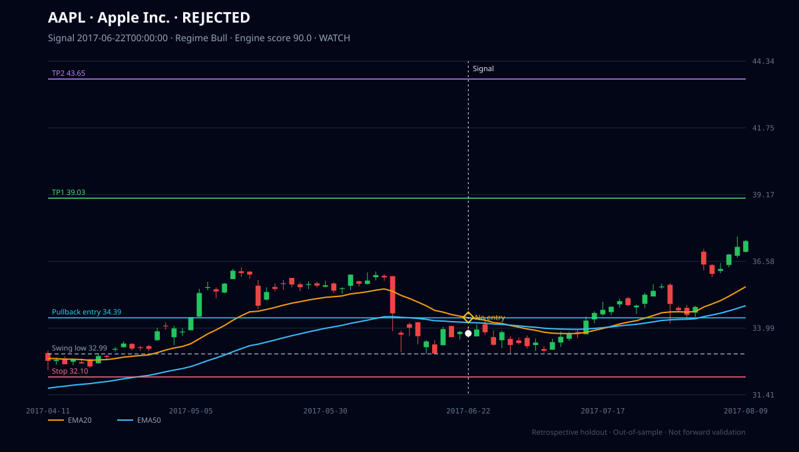

| Field | Audited value |
| --- | --- |
| Signal date / data timestamp | 2017-06-22 / `2017-06-22T00:00:00` |
| Market regime | Bull · engine 90 · The benchmark regime is risk-on based on 50/200-day EMA alignment. |
| Confidence / recommendation | 60 / WATCH |
| Signal price | 33.787498 |
| Proposed EMA20 pullback / expected fill | 34.391130 / 34.408326 |
| Actual entry | Not entered / — |
| Swing low / stop | 32.991700 / 32.098808 |
| TP1 / TP2 | 39.027361 / 43.646396 |
| £10,000 position size | 43 shares · £1479.56 value |
| Maximum monetary risk | £99.31 of £100.00 budget |
| Holding period | 0 completed candles |
| Costs / slippage | £0.00 / £0.00 |
| Final result / normalized source ledger | No trade |
| MFE / MAE | Not applicable — no entry |
| Rejection or expiry reason | Position risk exceeds 5% of entry price |

### Qualification audit

- Signal calculations used completed daily candles ending 2017-06-22; no later candle was supplied to the analysis engines.
- Signal-time EMA20 was 34.391130; the frozen entry window was 3 completed sessions.
- Signal-time ATR was 0.595261 and the 20-session swing low was 32.991700.
- Institutional market-regime score 90 met the frozen >=65 long-entry gate.
- Per-share risk was 6.7121% of entry, above the frozen 5% maximum; no position was opened.

### £10,000 account exit legs

No exit legs exist because no position was entered.

Audit checks: **13/13 passed**. Raw source: [`AAPL.csv`](../artifacts/trade_evidence/raw/AAPL.csv).

## E27 Rejected: XOM

**Exxon Mobil Corporation · Energy**

**Classification:** RETROSPECTIVE HOLDOUT · OUT-OF-SAMPLE · NOT FORWARD VALIDATION

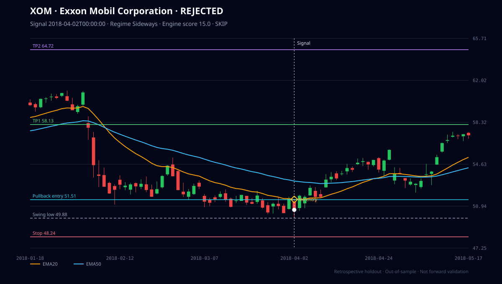

| Field | Audited value |
| --- | --- |
| Signal date / data timestamp | 2018-04-02 / `2018-04-02T00:00:00` |
| Market regime | Sideways · engine 15 · The benchmark regime is defensive based on 50/200-day EMA alignment. |
| Confidence / recommendation | 51 / SKIP |
| Signal price | 50.616325 |
| Proposed EMA20 pullback / expected fill | 51.509210 / 51.534965 |
| Actual entry | Not entered / — |
| Swing low / stop | 49.883559 / 48.239242 |
| TP1 / TP2 | 58.126410 / 64.717856 |
| £10,000 position size | 30 shares · £1546.05 value |
| Maximum monetary risk | £98.87 of £100.00 budget |
| Holding period | 0 completed candles |
| Costs / slippage | £0.00 / £0.00 |
| Final result / normalized source ledger | No trade |
| MFE / MAE | Not applicable — no entry |
| Rejection or expiry reason | Market regime filter disallowed long entry |

### Qualification audit

- Signal calculations used completed daily candles ending 2018-04-02; no later candle was supplied to the analysis engines.
- Signal-time EMA20 was 51.509210; the frozen entry window was 3 completed sessions.
- Signal-time ATR was 1.096211 and the 20-session swing low was 49.883559.
- Institutional market-regime score 15 failed the frozen >=65 long-entry gate.
- The market-regime gate failed before an entry could be activated; no position was opened.

### £10,000 account exit legs

No exit legs exist because no position was entered.

Audit checks: **13/13 passed**. Raw source: [`XOM.csv`](../artifacts/trade_evidence/raw/XOM.csv).

## E28 Rejected: BAC

**Bank of America Corporation · Financials**

**Classification:** RETROSPECTIVE HOLDOUT · OUT-OF-SAMPLE · NOT FORWARD VALIDATION

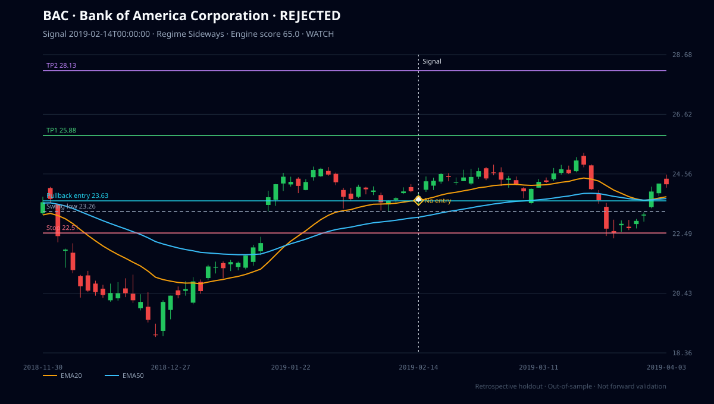

| Field | Audited value |
| --- | --- |
| Signal date / data timestamp | 2019-02-14 / `2019-02-14T00:00:00` |
| Market regime | Sideways · engine 65 · The benchmark regime is risk-on based on 50/200-day EMA alignment. |
| Confidence / recommendation | 68 / WATCH |
| Signal price | 23.700207 |
| Proposed EMA20 pullback / expected fill | 23.625192 / 23.637005 |
| Actual entry | Not entered / — |
| Swing low / stop | 23.257758 / 22.513574 |
| TP1 / TP2 | 25.883867 / 28.130729 |
| £10,000 position size | 89 shares · £2103.69 value |
| Maximum monetary risk | £99.99 of £100.00 budget |
| Holding period | 0 completed candles |
| Costs / slippage | £0.00 / £0.00 |
| Final result / normalized source ledger | No trade |
| MFE / MAE | Not applicable — no entry |
| Rejection or expiry reason | Overlapping position for ticker |

### Qualification audit

- Signal calculations used completed daily candles ending 2019-02-14; no later candle was supplied to the analysis engines.
- Signal-time EMA20 was 23.625192; the frozen entry window was 3 completed sessions.
- Signal-time ATR was 0.496123 and the 20-session swing low was 23.257758.
- Institutional market-regime score 65 met the frozen >=65 long-entry gate.
- Existing position existing_market_regime-BAC-2019-02-13 was still active; the candidate was not evaluated as a new entry.

### £10,000 account exit legs

No exit legs exist because no position was entered.

Audit checks: **13/13 passed**. Raw source: [`BAC.csv`](../artifacts/trade_evidence/raw/BAC.csv).

## E29 Rejected: ABBV

**AbbVie Inc. · Health Care**

**Classification:** RETROSPECTIVE HOLDOUT · OUT-OF-SAMPLE · NOT FORWARD VALIDATION

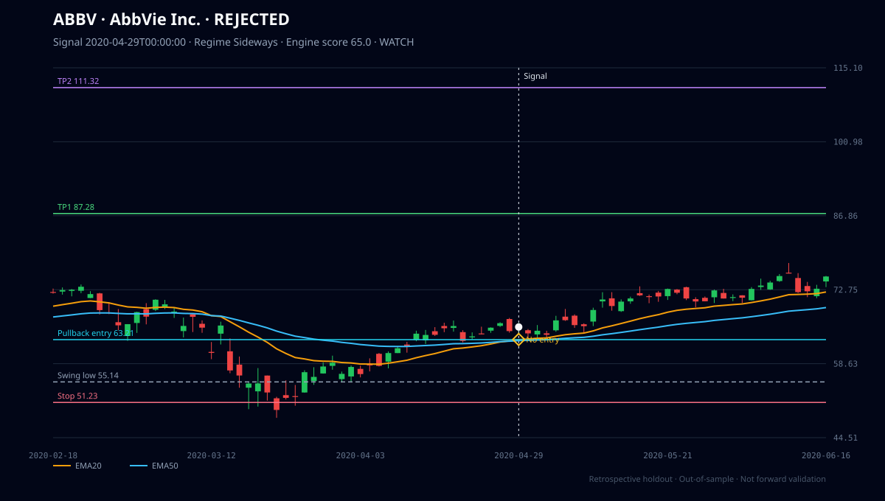

| Field | Audited value |
| --- | --- |
| Signal date / data timestamp | 2020-04-29 / `2020-04-29T00:00:00` |
| Market regime | Sideways · engine 65 · The benchmark regime is risk-on based on 50/200-day EMA alignment. |
| Confidence / recommendation | 73 / WATCH |
| Signal price | 65.626793 |
| Proposed EMA20 pullback / expected fill | 63.214265 / 63.245873 |
| Actual entry | Not entered / — |
| Swing low / stop | 55.143725 / 51.226845 |
| TP1 / TP2 | 87.283927 / 111.321982 |
| £10,000 position size | 8 shares · £505.97 value |
| Maximum monetary risk | £96.15 of £100.00 budget |
| Holding period | 0 completed candles |
| Costs / slippage | £0.00 / £0.00 |
| Final result / normalized source ledger | No trade |
| MFE / MAE | Not applicable — no entry |
| Rejection or expiry reason | Position risk exceeds 5% of entry price |

### Qualification audit

- Signal calculations used completed daily candles ending 2020-04-29; no later candle was supplied to the analysis engines.
- Signal-time EMA20 was 63.214265; the frozen entry window was 3 completed sessions.
- Signal-time ATR was 2.611253 and the 20-session swing low was 55.143725.
- Institutional market-regime score 65 met the frozen >=65 long-entry gate.
- Per-share risk was 19.0037% of entry, above the frozen 5% maximum; no position was opened.

### £10,000 account exit legs

No exit legs exist because no position was entered.

Audit checks: **13/13 passed**. Raw source: [`ABBV.csv`](../artifacts/trade_evidence/raw/ABBV.csv).

## E30 Rejected: ABBV

**AbbVie Inc. · Health Care**

**Classification:** RETROSPECTIVE HOLDOUT · OUT-OF-SAMPLE · NOT FORWARD VALIDATION

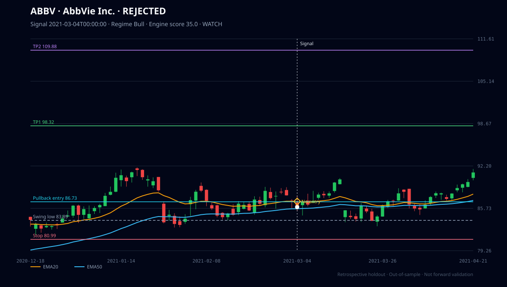

| Field | Audited value |
| --- | --- |
| Signal date / data timestamp | 2021-03-04 / `2021-03-04T00:00:00` |
| Market regime | Bull · engine 35 · The benchmark regime is defensive based on 50/200-day EMA alignment. |
| Confidence / recommendation | 68 / WATCH |
| Signal price | 85.922508 |
| Proposed EMA20 pullback / expected fill | 86.727246 / 86.770610 |
| Actual entry | Not entered / — |
| Swing low / stop | 83.889328 / 80.993914 |
| TP1 / TP2 | 98.324002 / 109.877394 |
| £10,000 position size | 17 shares · £1475.10 value |
| Maximum monetary risk | £98.20 of £100.00 budget |
| Holding period | 0 completed candles |
| Costs / slippage | £0.00 / £0.00 |
| Final result / normalized source ledger | No trade |
| MFE / MAE | Not applicable — no entry |
| Rejection or expiry reason | Market regime filter disallowed long entry |

### Qualification audit

- Signal calculations used completed daily candles ending 2021-03-04; no later candle was supplied to the analysis engines.
- Signal-time EMA20 was 86.727246; the frozen entry window was 3 completed sessions.
- Signal-time ATR was 1.930276 and the 20-session swing low was 83.889328.
- Institutional market-regime score 35 failed the frozen >=65 long-entry gate.
- The market-regime gate failed before an entry could be activated; no position was opened.

### £10,000 account exit legs

No exit legs exist because no position was entered.

Audit checks: **13/13 passed**. Raw source: [`ABBV.csv`](../artifacts/trade_evidence/raw/ABBV.csv).
