# Historical Trade Evidence Pack

## Scope and limitations

This pack contains transparent examples from the frozen Regime-Gated Pullback swing strategy. Every example is a **retrospective holdout** and **out-of-sample** observation from the unused 2016-07-01 through 2021-07-10 window. None is a live forward-validation trade.

**These examples do not guarantee future profitability.** They show how fixed rules behaved on selected historical candles after costs and slippage.

- Strategy version: `regime-gated-pullback-v1.0.0`
- Examples: 30 (10 winners, 10 losers, 5 expired signals, 5 rejected candidates)
- Sectors covered: Communication Services, Consumer Discretionary, Consumer Staples, Energy, Financials, Health Care, Industrials, Materials, Real Estate, Technology, Utilities
- Historical regimes covered: Bear, Bull, Sideways
- Signal years covered: 2017, 2018, 2019, 2020, 2021
- Account illustration: £10,000 cash account with a 1% (£100) maximum risk budget; whole shares only and no leverage.
- Currency assumption: historical US price units are treated as GBP-equivalent for the requested sizing illustration; no historical USD/GBP conversion is applied.
- Execution: 5 bps adverse entry/exit slippage, 5 bps transaction cost per side, 50% at TP1, original stop retained, and stop-first same-candle handling.
- The source holdout ledger normalizes trades to 100 shares. Monetary legs below replay the requested account size; odd whole-share splits can therefore produce a small R difference while dates, levels, and fills remain identical.

## Audit method

For each signal, the analysis engines receive only stock and SPY candles timestamped at or before the signal close. The EMA20, EMA50, ATR, swing low, entry, stop, targets, position size, execution legs, costs, R result, MFE, and MAE are recomputed from bundled raw OHLCV. Executed examples are reconciled to the locked source ledger; expired and rejected examples are verified to contain no entry or exit.

The Milestone 34 audit found that its original record IDs were explicitly enumerated. Replays were deterministic, but the selection itself could not prove freedom from judgment. This pack supersedes that registry with `seeded-balanced-stratified-v1`: every out-of-sample candidate in the full locked ledger enters the population, outcome quotas are fixed before selection, sector/regime/year under-representation is minimized at every draw, and SHA-256 of the published seed plus immutable candidate key resolves ties. Running the selector twice returns the same ordered keys and digest.

- Full candidate population: 111,348
- Population outcome counts: {'EXPIRED': 45635, 'LOSER': 368, 'REJECTED': 64878, 'WINNER': 467}
- Published selection seed: `BEAU-AI-TRADER:HISTORICAL-EVIDENCE:2026-07-25`
- Ordered selection digest: `daf79f4b4933d7c3860ae52478d86d3583c058234674d1e8d8f5150a471c7b4f`
- Deterministic replay: **verified**
- The 30-card sample is deliberately balanced for audit coverage, not weighted to reproduce population frequencies. Full-ledger statistics, not card counts, must be used for historical rates.

The raw snapshots are stored in `artifacts/trade_evidence/raw/`, the selected source rows in `artifacts/trade_evidence/selected_trade_ledger.json`, and the full machine-readable audit in `artifacts/trade_evidence_summary.json`.

## Evidence index

| ID | Outcome | Ticker | Sector | Signal | Regime | Confidence | Recommendation | Final R |
| --- | --- | --- | --- | --- | --- | ---: | --- | ---: |
| [E01](#e01-winner-duk) | WINNER | DUK | Utilities | 2018-07-23 | Bull | 66 | WATCH | 0.6586R |
| [E02](#e02-loser-bac) | LOSER | BAC | Financials | 2019-02-13 | Sideways | 65 | WATCH | -1.0308R |
| [E03](#e03-expired-mcd) | EXPIRED | MCD | Consumer Discretionary | 2020-05-12 | Bear | 56 | SKIP | — |
| [E04](#e04-rejected-abt) | REJECTED | ABT | Health Care | 2021-01-12 | Bull | 71 | WATCH | — |
| [E05](#e05-winner-cost) | WINNER | COST | Consumer Staples | 2019-02-08 | Sideways | 53 | SKIP | 2.3908R |
| [E06](#e06-loser-ko) | LOSER | KO | Consumer Staples | 2019-01-28 | Bear | 52 | SKIP | -1.0298R |
| [E07](#e07-expired-nflx) | EXPIRED | NFLX | Communication Services | 2017-08-14 | Bull | 73 | WATCH | — |
| [E08](#e08-rejected-psa) | REJECTED | PSA | Real Estate | 2020-05-07 | Bear | 54 | SKIP | — |
| [E09](#e09-winner-well) | WINNER | WELL | Real Estate | 2019-02-22 | Sideways | 73 | WATCH | 0.3907R |
| [E10](#e10-loser-ibm) | LOSER | IBM | Technology | 2018-10-02 | Bull | 70 | WATCH | -1.0291R |
| [E11](#e11-expired-lin) | EXPIRED | LIN | Materials | 2020-06-03 | Sideways | 72 | WATCH | — |
| [E12](#e12-rejected-xom) | REJECTED | XOM | Energy | 2018-12-21 | Bear | 54 | SKIP | — |
| [E13](#e13-winner-de) | WINNER | DE | Industrials | 2017-06-20 | Bull | 73 | WATCH | 0.9424R |
| [E14](#e14-loser-dis) | LOSER | DIS | Communication Services | 2019-02-04 | Sideways | 69 | WATCH | -0.5367R |
| [E15](#e15-expired-csco) | EXPIRED | CSCO | Technology | 2020-04-14 | Bear | 58 | SKIP | — |
| [E16](#e16-rejected-gm) | REJECTED | GM | Consumer Discretionary | 2021-03-04 | Bull | 71 | WATCH | — |
| [E17](#e17-winner-mcd) | WINNER | MCD | Consumer Discretionary | 2019-02-12 | Sideways | 60 | WATCH | 1.4257R |
| [E18](#e18-loser-mrk) | LOSER | MRK | Health Care | 2021-04-12 | Bull | 59 | SKIP | -1.0374R |
| [E19](#e19-expired-so) | EXPIRED | SO | Utilities | 2020-05-04 | Bear | 50 | SKIP | — |
| [E20](#e20-rejected-cme) | REJECTED | CME | Financials | 2018-12-07 | Sideways | 64 | WATCH | — |
| [E21](#e21-winner-vlo) | WINNER | VLO | Energy | 2017-10-23 | Bull | 78 | BUY | 2.2840R |
| [E22](#e22-loser-etn) | LOSER | ETN | Industrials | 2017-10-27 | Bull | 71 | WATCH | -0.0460R |
| [E23](#e23-winner-lin) | WINNER | LIN | Materials | 2021-04-30 | Bull | 80 | BUY | 0.5131R |
| [E24](#e24-loser-eqr) | LOSER | EQR | Real Estate | 2017-11-24 | Bull | 62 | WATCH | -1.0295R |
| [E25](#e25-winner-msft) | WINNER | MSFT | Technology | 2018-08-17 | Bull | 66 | WATCH | 1.5354R |
| [E26](#e26-loser-shw) | LOSER | SHW | Materials | 2021-01-06 | Bull | 73 | WATCH | -1.0305R |
| [E27](#e27-winner-dhr) | WINNER | DHR | Health Care | 2020-12-29 | Bull | 60 | WATCH | 1.7716R |
| [E28](#e28-loser-exc) | LOSER | EXC | Utilities | 2018-09-12 | Bull | 75 | BUY | -1.0451R |
| [E29](#e29-winner-t) | WINNER | T | Communication Services | 2021-02-02 | Bull | 62 | WATCH | 0.7723R |
| [E30](#e30-loser-kmi) | LOSER | KMI | Energy | 2017-09-21 | Bull | 58 | SKIP | -1.0307R |

## E01 Winner: DUK

**Duke Energy Corporation · Utilities**

**Classification:** RETROSPECTIVE HOLDOUT · OUT-OF-SAMPLE · NOT FORWARD VALIDATION

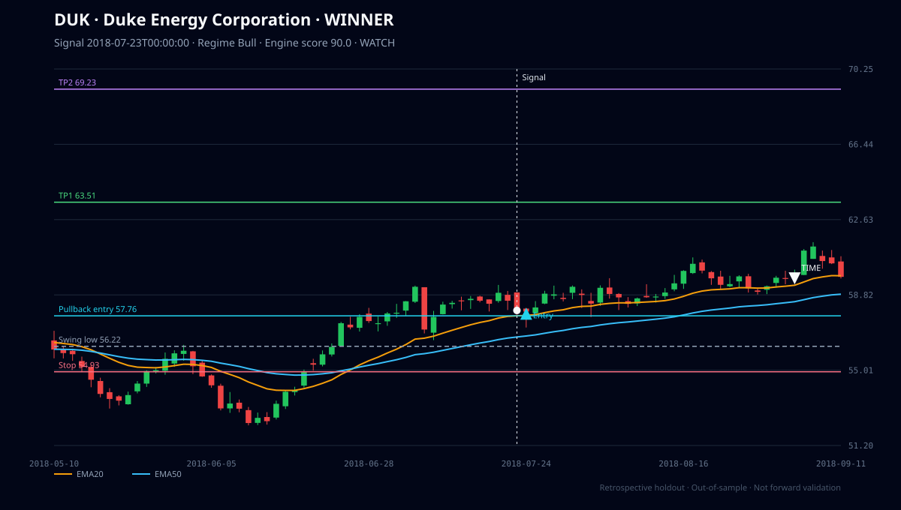

| Field | Audited value |
| --- | --- |
| Signal date / data timestamp | 2018-07-23 / `2018-07-23T00:00:00` |
| Market regime | Bull · engine 90 · The benchmark regime is risk-on based on 50/200-day EMA alignment. |
| Confidence / recommendation | 66 / WATCH |
| Signal price | 58.033585 |
| Proposed EMA20 pullback / expected fill | 57.762307 / 57.791188 |
| Actual entry | 2018-07-24 / 57.791188 |
| Swing low / stop | 56.219384 / 54.931209 |
| TP1 / TP2 | 63.511148 / 69.231107 |
| £10,000 position size | 34 shares · £1964.90 value |
| Maximum monetary risk | £97.24 of £100.00 budget |
| Holding period | 30 completed candles |
| Costs / slippage | £2.00 / £2.00 |
| Final result / normalized source ledger | 0.658575R / £64.04 / 0.658575R |
| MFE / MAE | 1.023214R / -0.217197R |
| Rejection or expiry reason | Not applicable |

### Qualification audit

- Signal calculations used completed daily candles ending 2018-07-23; no later candle was supplied to the analysis engines.
- Signal-time EMA20 was 57.762307; the frozen entry window was 3 completed sessions.
- Signal-time ATR was 0.858783 and the 20-session swing low was 56.219384.
- Institutional market-regime score 90 met the frozen >=65 long-entry gate.
- The EMA20 limit traded on 2018-07-24, session 1 of 3.
- Stop 54.931209 was below executable fill 57.791188.
- Per-share risk was 4.9488% of entry, within the frozen 5% maximum.
- No same-ticker position overlapped this accepted entry.

### £10,000 account exit legs

| Leg | Date | Shares | Reference | Fill | Net P/L | R contribution |
| --- | --- | ---: | ---: | ---: | ---: | ---: |
| TIME | 2018-09-04 | 34 | 59.763344 | 59.733462 | £64.04 | 0.658575R |

Audit checks: **22/22 passed**. Raw source: [`DUK.csv`](../artifacts/trade_evidence/raw/DUK.csv).

## E02 Loser: BAC

**Bank of America Corporation · Financials**

**Classification:** RETROSPECTIVE HOLDOUT · OUT-OF-SAMPLE · NOT FORWARD VALIDATION

| Field | Audited value |
| --- | --- |
| Signal date / data timestamp | 2019-02-13 / `2019-02-13T00:00:00` |
| Market regime | Sideways · engine 65 · The benchmark regime is risk-on based on 50/200-day EMA alignment. |
| Confidence / recommendation | 65 / WATCH |
| Signal price | 23.959005 |
| Proposed EMA20 pullback / expected fill | 23.617296 / 23.629104 |
| Actual entry | 2019-02-14 / 23.629104 |
| Swing low / stop | 23.257758 / 22.513161 |
| TP1 / TP2 | 25.860992 / 28.092879 |
| £10,000 position size | 89 shares · £2102.99 value |
| Maximum monetary risk | £99.32 of £100.00 budget |
| Holding period | 26 completed candles |
| Costs / slippage | £2.05 / £2.05 |
| Final result / normalized source ledger | -1.030756R / £-102.37 / -1.030756R |
| MFE / MAE | 1.487963R / -1.091031R |
| Rejection or expiry reason | Not applicable |

### Qualification audit

- Signal calculations used completed daily candles ending 2019-02-13; no later candle was supplied to the analysis engines.
- Signal-time EMA20 was 23.617296; the frozen entry window was 3 completed sessions.
- Signal-time ATR was 0.496398 and the 20-session swing low was 23.257758.
- Institutional market-regime score 65 met the frozen >=65 long-entry gate.
- The EMA20 limit traded on 2019-02-14, session 1 of 3.
- Stop 22.513161 was below executable fill 23.629104.
- Per-share risk was 4.7228% of entry, within the frozen 5% maximum.
- No same-ticker position overlapped this accepted entry.

### £10,000 account exit legs

| Leg | Date | Shares | Reference | Fill | Net P/L | R contribution |
| --- | --- | ---: | ---: | ---: | ---: | ---: |
| STOP | 2019-03-22 | 89 | 22.513161 | 22.501904 | £-102.37 | -1.030756R |

Audit checks: **22/22 passed**. Raw source: [`BAC.csv`](../artifacts/trade_evidence/raw/BAC.csv).

## E03 Expired: MCD

**McDonald's Corporation · Consumer Discretionary**

**Classification:** RETROSPECTIVE HOLDOUT · OUT-OF-SAMPLE · NOT FORWARD VALIDATION

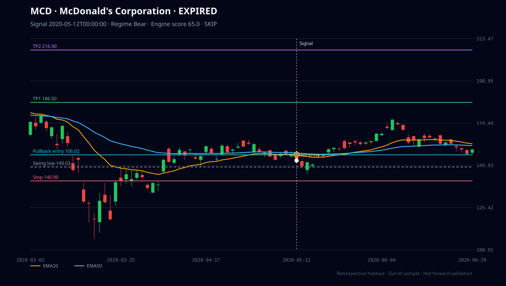

| Field | Audited value |
| --- | --- |
| Signal date / data timestamp | 2020-05-12 / `2020-05-12T00:00:00` |
| Market regime | Bear · engine 65 · The benchmark regime is risk-on based on 50/200-day EMA alignment. |
| Confidence / recommendation | 56 / SKIP |
| Signal price | 152.724701 |
| Proposed EMA20 pullback / expected fill | 156.022404 / 156.100415 |
| Actual entry | Not entered / — |
| Swing low / stop | 149.030748 / 140.900614 |
| TP1 / TP2 | 186.500018 / 216.899620 |
| £10,000 position size | 6 shares · £936.60 value |
| Maximum monetary risk | £91.20 of £100.00 budget |
| Holding period | 0 completed candles |
| Costs / slippage | £0.00 / £0.00 |
| Final result / normalized source ledger | No trade |
| MFE / MAE | Not applicable — no entry |
| Rejection or expiry reason | Pullback limit was not traded within 3 candles |

### Qualification audit

- Signal calculations used completed daily candles ending 2020-05-12; no later candle was supplied to the analysis engines.
- Signal-time EMA20 was 156.022404; the frozen entry window was 3 completed sessions.
- Signal-time ATR was 5.420089 and the 20-session swing low was 149.030748.
- Institutional market-regime score 65 met the frozen >=65 long-entry gate.
- None of the next 3 raw candles traded through the EMA20 limit; no position was opened.

### £10,000 account exit legs

No exit legs exist because no position was entered.

Audit checks: **16/16 passed**. Raw source: [`MCD.csv`](../artifacts/trade_evidence/raw/MCD.csv).

## E04 Rejected: ABT

**Abbott Laboratories · Health Care**

**Classification:** RETROSPECTIVE HOLDOUT · OUT-OF-SAMPLE · NOT FORWARD VALIDATION

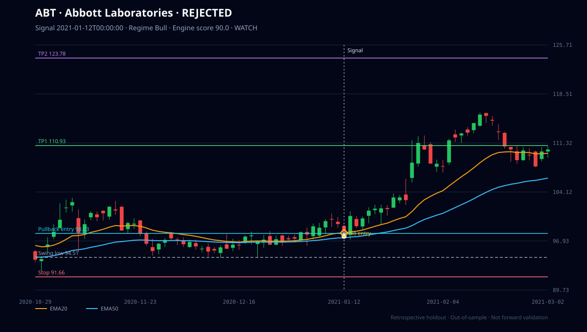

| Field | Audited value |
| --- | --- |
| Signal date / data timestamp | 2021-01-12 / `2021-01-12T00:00:00` |
| Market regime | Bull · engine 90 · The benchmark regime is risk-on based on 50/200-day EMA alignment. |
| Confidence / recommendation | 71 / WATCH |
| Signal price | 97.626320 |
| Proposed EMA20 pullback / expected fill | 98.033658 / 98.082675 |
| Actual entry | Not entered / — |
| Swing low / stop | 94.513798 / 91.658490 |
| TP1 / TP2 | 110.931047 / 123.779418 |
| £10,000 position size | 15 shares · £1471.24 value |
| Maximum monetary risk | £96.36 of £100.00 budget |
| Holding period | 0 completed candles |
| Costs / slippage | £0.00 / £0.00 |
| Final result / normalized source ledger | No trade |
| MFE / MAE | Not applicable — no entry |
| Rejection or expiry reason | Position risk exceeds 5% of entry price |

### Qualification audit

- Signal calculations used completed daily candles ending 2021-01-12; no later candle was supplied to the analysis engines.
- Signal-time EMA20 was 98.033658; the frozen entry window was 3 completed sessions.
- Signal-time ATR was 1.903539 and the 20-session swing low was 94.513798.
- Institutional market-regime score 90 met the frozen >=65 long-entry gate.
- Per-share risk was 6.5498% of entry, above the frozen 5% maximum; no position was opened.

### £10,000 account exit legs

No exit legs exist because no position was entered.

Audit checks: **16/16 passed**. Raw source: [`ABT.csv`](../artifacts/trade_evidence/raw/ABT.csv).

## E05 Winner: COST

**Costco Wholesale Corporation · Consumer Staples**

**Classification:** RETROSPECTIVE HOLDOUT · OUT-OF-SAMPLE · NOT FORWARD VALIDATION

| Field | Audited value |
| --- | --- |
| Signal date / data timestamp | 2019-02-08 / `2019-02-08T00:00:00` |
| Market regime | Sideways · engine 65 · The benchmark regime is risk-on based on 50/200-day EMA alignment. |
| Confidence / recommendation | 53 / SKIP |
| Signal price | 187.769318 |
| Proposed EMA20 pullback / expected fill | 189.715341 / 189.810199 |
| Actual entry | 2019-02-12 / 189.810199 |
| Swing low / stop | 185.961671 / 180.588037 |
| TP1 / TP2 | 208.254523 / 226.698846 |
| £10,000 position size | 10 shares · £1898.10 value |
| Maximum monetary risk | £92.22 of £100.00 budget |
| Holding period | 30 completed candles |
| Costs / slippage | £2.01 / £2.01 |
| Final result / normalized source ledger | 2.390826R / £220.49 / 2.390826R |
| MFE / MAE | 2.972699R / -0.073311R |
| Rejection or expiry reason | Not applicable |

### Qualification audit

- Signal calculations used completed daily candles ending 2019-02-08; no later candle was supplied to the analysis engines.
- Signal-time EMA20 was 189.715341; the frozen entry window was 3 completed sessions.
- Signal-time ATR was 3.582423 and the 20-session swing low was 185.961671.
- Institutional market-regime score 65 met the frozen >=65 long-entry gate.
- The EMA20 limit traded on 2019-02-12, session 2 of 3.
- Stop 180.588037 was below executable fill 189.810199.
- Per-share risk was 4.8586% of entry, within the frozen 5% maximum.
- No same-ticker position overlapped this accepted entry.

### £10,000 account exit legs

| Leg | Date | Shares | Reference | Fill | Net P/L | R contribution |
| --- | --- | ---: | ---: | ---: | ---: | ---: |
| TP1 | 2019-03-12 | 5 | 208.254523 | 208.150395 | £90.71 | 0.983566R |
| TIME | 2019-03-26 | 5 | 216.077087 | 215.969049 | £129.78 | 1.407260R |

Audit checks: **22/22 passed**. Raw source: [`COST.csv`](../artifacts/trade_evidence/raw/COST.csv).

## E06 Loser: KO

**The Coca-Cola Company · Consumer Staples**

**Classification:** RETROSPECTIVE HOLDOUT · OUT-OF-SAMPLE · NOT FORWARD VALIDATION

| Field | Audited value |
| --- | --- |
| Signal date / data timestamp | 2019-01-28 / `2019-01-28T00:00:00` |
| Market regime | Bear · engine 65 · The benchmark regime is risk-on based on 50/200-day EMA alignment. |
| Confidence / recommendation | 52 / SKIP |
| Signal price | 37.532562 |
| Proposed EMA20 pullback / expected fill | 37.784797 / 37.803689 |
| Actual entry | 2019-01-29 / 37.803689 |
| Swing low / stop | 36.872144 / 35.964938 |
| TP1 / TP2 | 41.481192 / 45.158694 |
| £10,000 position size | 54 shares · £2041.40 value |
| Maximum monetary risk | £99.29 of £100.00 budget |
| Holding period | 15 completed candles |
| Costs / slippage | £1.99 / £1.99 |
| Final result / normalized source ledger | -1.029834R / £-102.25 / -1.029834R |
| MFE / MAE | 1.051217R / -1.186008R |
| Rejection or expiry reason | Not applicable |

### Qualification audit

- Signal calculations used completed daily candles ending 2019-01-28; no later candle was supplied to the analysis engines.
- Signal-time EMA20 was 37.784797; the frozen entry window was 3 completed sessions.
- Signal-time ATR was 0.604804 and the 20-session swing low was 36.872144.
- Institutional market-regime score 65 met the frozen >=65 long-entry gate.
- The EMA20 limit traded on 2019-01-29, session 1 of 3.
- Stop 35.964938 was below executable fill 37.803689.
- Per-share risk was 4.8639% of entry, within the frozen 5% maximum.
- No same-ticker position overlapped this accepted entry.

### £10,000 account exit legs

| Leg | Date | Shares | Reference | Fill | Net P/L | R contribution |
| --- | --- | ---: | ---: | ---: | ---: | ---: |
| STOP | 2019-02-19 | 54 | 35.964938 | 35.946955 | £-102.25 | -1.029834R |

Audit checks: **22/22 passed**. Raw source: [`KO.csv`](../artifacts/trade_evidence/raw/KO.csv).

## E07 Expired: NFLX

**Netflix, Inc. · Communication Services**

**Classification:** RETROSPECTIVE HOLDOUT · OUT-OF-SAMPLE · NOT FORWARD VALIDATION

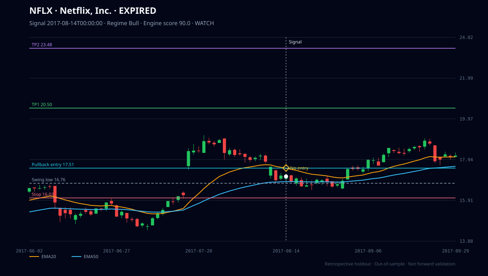

| Field | Audited value |
| --- | --- |
| Signal date / data timestamp | 2017-08-14 / `2017-08-14T00:00:00` |
| Market regime | Bull · engine 90 · The benchmark regime is risk-on based on 50/200-day EMA alignment. |
| Confidence / recommendation | 73 / WATCH |
| Signal price | 17.100000 |
| Proposed EMA20 pullback / expected fill | 17.511659 / 17.520415 |
| Actual entry | Not entered / — |
| Swing low / stop | 16.760000 / 16.030896 |
| TP1 / TP2 | 20.499452 / 23.478489 |
| £10,000 position size | 67 shares · £1173.87 value |
| Maximum monetary risk | £99.80 of £100.00 budget |
| Holding period | 0 completed candles |
| Costs / slippage | £0.00 / £0.00 |
| Final result / normalized source ledger | No trade |
| MFE / MAE | Not applicable — no entry |
| Rejection or expiry reason | Pullback limit was not traded within 3 candles |

### Qualification audit

- Signal calculations used completed daily candles ending 2017-08-14; no later candle was supplied to the analysis engines.
- Signal-time EMA20 was 17.511659; the frozen entry window was 3 completed sessions.
- Signal-time ATR was 0.486070 and the 20-session swing low was 16.760000.
- Institutional market-regime score 90 met the frozen >=65 long-entry gate.
- None of the next 3 raw candles traded through the EMA20 limit; no position was opened.

### £10,000 account exit legs

No exit legs exist because no position was entered.

Audit checks: **16/16 passed**. Raw source: [`NFLX.csv`](../artifacts/trade_evidence/raw/NFLX.csv).

## E08 Rejected: PSA

**Public Storage · Real Estate**

**Classification:** RETROSPECTIVE HOLDOUT · OUT-OF-SAMPLE · NOT FORWARD VALIDATION

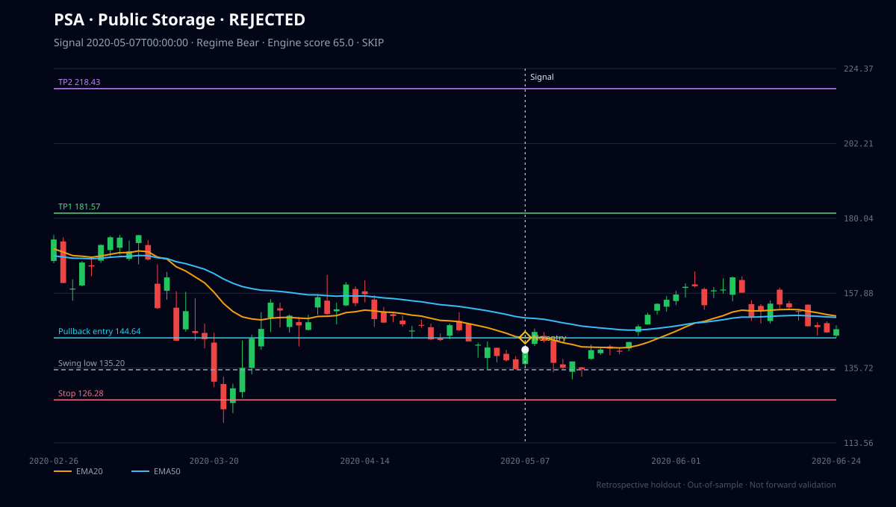

| Field | Audited value |
| --- | --- |
| Signal date / data timestamp | 2020-05-07 / `2020-05-07T00:00:00` |
| Market regime | Bear · engine 65 · The benchmark regime is risk-on based on 50/200-day EMA alignment. |
| Confidence / recommendation | 54 / SKIP |
| Signal price | 141.134583 |
| Proposed EMA20 pullback / expected fill | 144.637033 / 144.709352 |
| Actual entry | Not entered / — |
| Swing low / stop | 135.204980 / 126.278631 |
| TP1 / TP2 | 181.570794 / 218.432236 |
| £10,000 position size | 5 shares · £723.55 value |
| Maximum monetary risk | £92.15 of £100.00 budget |
| Holding period | 0 completed candles |
| Costs / slippage | £0.00 / £0.00 |
| Final result / normalized source ledger | No trade |
| MFE / MAE | Not applicable — no entry |
| Rejection or expiry reason | Position risk exceeds 5% of entry price |

### Qualification audit

- Signal calculations used completed daily candles ending 2020-05-07; no later candle was supplied to the analysis engines.
- Signal-time EMA20 was 144.637033; the frozen entry window was 3 completed sessions.
- Signal-time ATR was 5.950899 and the 20-session swing low was 135.204980.
- Institutional market-regime score 65 met the frozen >=65 long-entry gate.
- Per-share risk was 12.7364% of entry, above the frozen 5% maximum; no position was opened.

### £10,000 account exit legs

No exit legs exist because no position was entered.

Audit checks: **16/16 passed**. Raw source: [`PSA.csv`](../artifacts/trade_evidence/raw/PSA.csv).

## E09 Winner: WELL

**Welltower Inc. · Real Estate**

**Classification:** RETROSPECTIVE HOLDOUT · OUT-OF-SAMPLE · NOT FORWARD VALIDATION

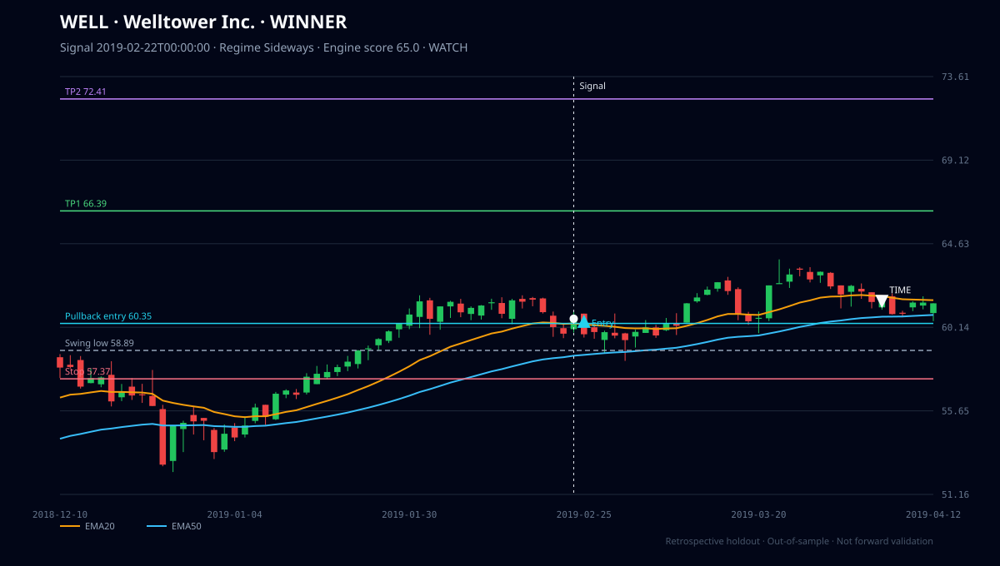

| Field | Audited value |
| --- | --- |
| Signal date / data timestamp | 2019-02-22 / `2019-02-22T00:00:00` |
| Market regime | Sideways · engine 65 · The benchmark regime is risk-on based on 50/200-day EMA alignment. |
| Confidence / recommendation | 73 / WATCH |
| Signal price | 60.598927 |
| Proposed EMA20 pullback / expected fill | 60.345870 / 60.376043 |
| Actual entry | 2019-02-25 / 60.376043 |
| Swing low / stop | 58.894485 / 57.367793 |
| TP1 / TP2 | 66.392542 / 72.409041 |
| £10,000 position size | 33 shares · £1992.41 value |
| Maximum monetary risk | £99.27 of £100.00 budget |
| Holding period | 30 completed candles |
| Costs / slippage | £2.01 / £2.01 |
| Final result / normalized source ledger | 0.390695R / £38.79 / 0.390695R |
| MFE / MAE | 1.134168R / -0.678922R |
| Rejection or expiry reason | Not applicable |

### Qualification audit

- Signal calculations used completed daily candles ending 2019-02-22; no later candle was supplied to the analysis engines.
- Signal-time EMA20 was 60.345870; the frozen entry window was 3 completed sessions.
- Signal-time ATR was 1.017795 and the 20-session swing low was 58.894485.
- Institutional market-regime score 65 met the frozen >=65 long-entry gate.
- The EMA20 limit traded on 2019-02-25, session 1 of 3.
- Stop 57.367793 was below executable fill 60.376043.
- Per-share risk was 4.9825% of entry, within the frozen 5% maximum.
- No same-ticker position overlapped this accepted entry.

### £10,000 account exit legs

| Leg | Date | Shares | Reference | Fill | Net P/L | R contribution |
| --- | --- | ---: | ---: | ---: | ---: | ---: |
| TIME | 2019-04-05 | 33 | 61.643166 | 61.612344 | £38.79 | 0.390695R |

Audit checks: **22/22 passed**. Raw source: [`WELL.csv`](../artifacts/trade_evidence/raw/WELL.csv).

## E10 Loser: IBM

**International Business Machines Corporation · Technology**

**Classification:** RETROSPECTIVE HOLDOUT · OUT-OF-SAMPLE · NOT FORWARD VALIDATION

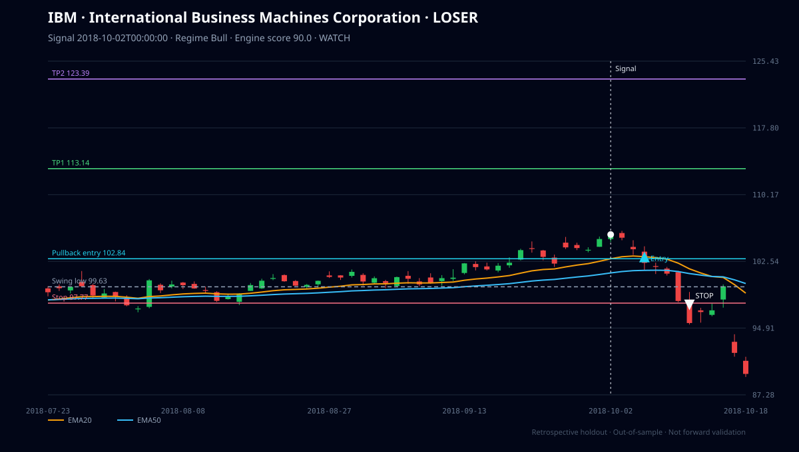

| Field | Audited value |
| --- | --- |
| Signal date / data timestamp | 2018-10-02 / `2018-10-02T00:00:00` |
| Market regime | Bull · engine 90 · The benchmark regime is risk-on based on 50/200-day EMA alignment. |
| Confidence / recommendation | 70 / WATCH |
| Signal price | 105.607803 |
| Proposed EMA20 pullback / expected fill | 102.838881 / 102.890300 |
| Actual entry | 2018-10-05 / 102.890300 |
| Swing low / stop | 99.631952 / 97.765448 |
| TP1 / TP2 | 113.140005 / 123.389710 |
| £10,000 position size | 19 shares · £1954.92 value |
| Maximum monetary risk | £97.37 of £100.00 budget |
| Holding period | 5 completed candles |
| Costs / slippage | £1.91 / £1.91 |
| Final result / normalized source ledger | -1.029110R / £-100.21 / -1.029110R |
| MFE / MAE | 0.267558R / -1.476154R |
| Rejection or expiry reason | Not applicable |

### Qualification audit

- Signal calculations used completed daily candles ending 2018-10-02; no later candle was supplied to the analysis engines.
- Signal-time EMA20 was 102.838881; the frozen entry window was 3 completed sessions.
- Signal-time ATR was 1.244336 and the 20-session swing low was 99.631952.
- Institutional market-regime score 90 met the frozen >=65 long-entry gate.
- The EMA20 limit traded on 2018-10-05, session 3 of 3.
- Stop 97.765448 was below executable fill 102.890300.
- Per-share risk was 4.9809% of entry, within the frozen 5% maximum.
- No same-ticker position overlapped this accepted entry.

### £10,000 account exit legs

| Leg | Date | Shares | Reference | Fill | Net P/L | R contribution |
| --- | --- | ---: | ---: | ---: | ---: | ---: |
| STOP | 2018-10-11 | 19 | 97.765448 | 97.716565 | £-100.21 | -1.029110R |

Audit checks: **22/22 passed**. Raw source: [`IBM.csv`](../artifacts/trade_evidence/raw/IBM.csv).

## E11 Expired: LIN

**Linde plc · Materials**

**Classification:** RETROSPECTIVE HOLDOUT · OUT-OF-SAMPLE · NOT FORWARD VALIDATION

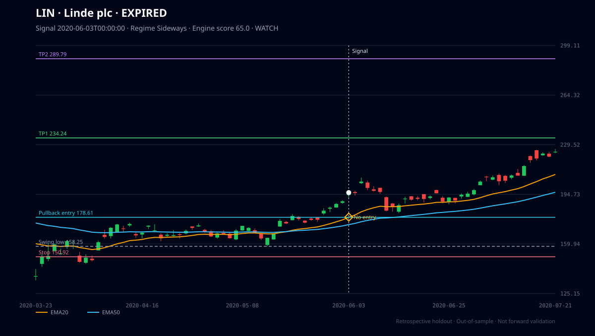

| Field | Audited value |
| --- | --- |
| Signal date / data timestamp | 2020-06-03 / `2020-06-03T00:00:00` |
| Market regime | Sideways · engine 65 · The benchmark regime is risk-on based on 50/200-day EMA alignment. |
| Confidence / recommendation | 72 / WATCH |
| Signal price | 195.923676 |
| Proposed EMA20 pullback / expected fill | 178.605998 / 178.695301 |
| Actual entry | Not entered / — |
| Swing low / stop | 158.245766 / 150.922106 |
| TP1 / TP2 | 234.241693 / 289.788085 |
| £10,000 position size | 3 shares · £536.09 value |
| Maximum monetary risk | £83.32 of £100.00 budget |
| Holding period | 0 completed candles |
| Costs / slippage | £0.00 / £0.00 |
| Final result / normalized source ledger | No trade |
| MFE / MAE | Not applicable — no entry |
| Rejection or expiry reason | Pullback limit was not traded within 3 candles |

### Qualification audit

- Signal calculations used completed daily candles ending 2020-06-03; no later candle was supplied to the analysis engines.
- Signal-time EMA20 was 178.605998; the frozen entry window was 3 completed sessions.
- Signal-time ATR was 4.882440 and the 20-session swing low was 158.245766.
- Institutional market-regime score 65 met the frozen >=65 long-entry gate.
- None of the next 3 raw candles traded through the EMA20 limit; no position was opened.

### £10,000 account exit legs

No exit legs exist because no position was entered.

Audit checks: **16/16 passed**. Raw source: [`LIN.csv`](../artifacts/trade_evidence/raw/LIN.csv).

## E12 Rejected: XOM

**Exxon Mobil Corporation · Energy**

**Classification:** RETROSPECTIVE HOLDOUT · OUT-OF-SAMPLE · NOT FORWARD VALIDATION

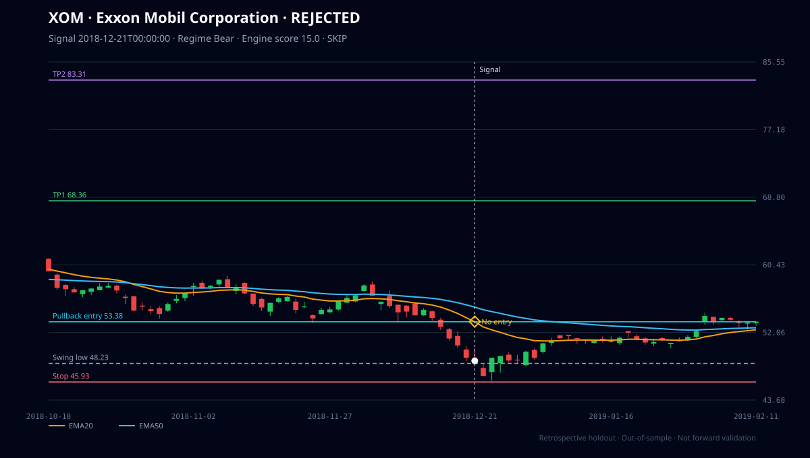

| Field | Audited value |
| --- | --- |
| Signal date / data timestamp | 2018-12-21 / `2018-12-21T00:00:00` |
| Market regime | Bear · engine 15 · The benchmark regime is defensive based on 50/200-day EMA alignment. |
| Confidence / recommendation | 54 / SKIP |
| Signal price | 48.545887 |
| Proposed EMA20 pullback / expected fill | 53.376215 / 53.402903 |
| Actual entry | Not entered / — |
| Swing low / stop | 48.225190 / 45.926391 |
| TP1 / TP2 | 68.355927 / 83.308951 |
| £10,000 position size | 13 shares · £694.24 value |
| Maximum monetary risk | £97.19 of £100.00 budget |
| Holding period | 0 completed candles |
| Costs / slippage | £0.00 / £0.00 |
| Final result / normalized source ledger | No trade |
| MFE / MAE | Not applicable — no entry |
| Rejection or expiry reason | Market regime filter disallowed long entry |

### Qualification audit

- Signal calculations used completed daily candles ending 2018-12-21; no later candle was supplied to the analysis engines.
- Signal-time EMA20 was 53.376215; the frozen entry window was 3 completed sessions.
- Signal-time ATR was 1.532533 and the 20-session swing low was 48.225190.
- Institutional market-regime score 15 failed the frozen >=65 long-entry gate.
- The market-regime gate failed before an entry could be activated; no position was opened.

### £10,000 account exit legs

No exit legs exist because no position was entered.

Audit checks: **16/16 passed**. Raw source: [`XOM.csv`](../artifacts/trade_evidence/raw/XOM.csv).

## E13 Winner: DE

**Deere & Company · Industrials**

**Classification:** RETROSPECTIVE HOLDOUT · OUT-OF-SAMPLE · NOT FORWARD VALIDATION

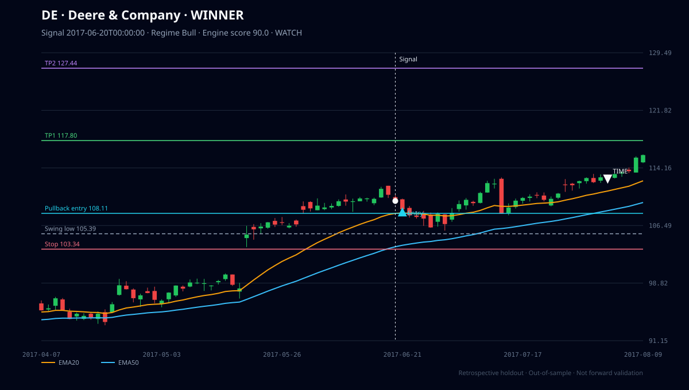

| Field | Audited value |
| --- | --- |
| Signal date / data timestamp | 2017-06-20 / `2017-06-20T00:00:00` |
| Market regime | Bull · engine 90 · The benchmark regime is risk-on based on 50/200-day EMA alignment. |
| Confidence / recommendation | 73 / WATCH |
| Signal price | 109.753433 |
| Proposed EMA20 pullback / expected fill | 108.105955 / 108.160008 |
| Actual entry | 2017-06-21 / 108.160008 |
| Swing low / stop | 105.390827 / 103.340879 |
| TP1 / TP2 | 117.798264 / 127.436521 |
| £10,000 position size | 20 shares · £2163.20 value |
| Maximum monetary risk | £96.38 of £100.00 budget |
| Holding period | 30 completed candles |
| Costs / slippage | £2.21 / £2.21 |
| Final result / normalized source ledger | 0.942432R / £90.83 / 0.942432R |
| MFE / MAE | 1.078757R / -0.486512R |
| Rejection or expiry reason | Not applicable |

### Qualification audit

- Signal calculations used completed daily candles ending 2017-06-20; no later candle was supplied to the analysis engines.
- Signal-time EMA20 was 108.105955; the frozen entry window was 3 completed sessions.
- Signal-time ATR was 1.366631 and the 20-session swing low was 105.390827.
- Institutional market-regime score 90 met the frozen >=65 long-entry gate.
- The EMA20 limit traded on 2017-06-21, session 1 of 3.
- Stop 103.340879 was below executable fill 108.160008.
- Per-share risk was 4.4556% of entry, within the frozen 5% maximum.
- No same-ticker position overlapped this accepted entry.

### £10,000 account exit legs

| Leg | Date | Shares | Reference | Fill | Net P/L | R contribution |
| --- | --- | ---: | ---: | ---: | ---: | ---: |
| TIME | 2017-08-02 | 20 | 112.868629 | 112.812195 | £90.83 | 0.942432R |

Audit checks: **22/22 passed**. Raw source: [`DE.csv`](../artifacts/trade_evidence/raw/DE.csv).

## E14 Loser: DIS

**The Walt Disney Company · Communication Services**

**Classification:** RETROSPECTIVE HOLDOUT · OUT-OF-SAMPLE · NOT FORWARD VALIDATION

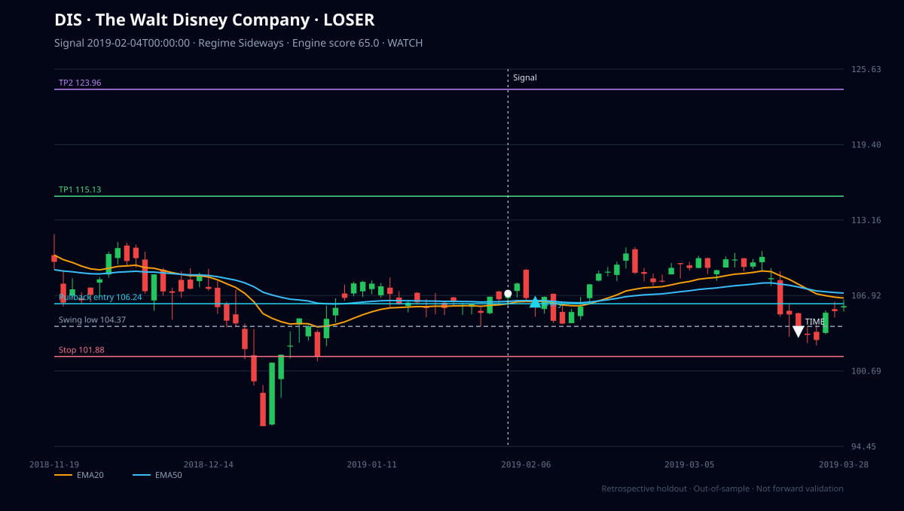

| Field | Audited value |
| --- | --- |
| Signal date / data timestamp | 2019-02-04 / `2019-02-04T00:00:00` |
| Market regime | Sideways · engine 65 · The benchmark regime is risk-on based on 50/200-day EMA alignment. |
| Confidence / recommendation | 69 / WATCH |
| Signal price | 107.088417 |
| Proposed EMA20 pullback / expected fill | 106.241179 / 106.294300 |
| Actual entry | 2019-02-07 / 106.294300 |
| Swing low / stop | 104.368109 / 101.876964 |
| TP1 / TP2 | 115.128970 / 123.963641 |
| £10,000 position size | 22 shares · £2338.47 value |
| Maximum monetary risk | £97.18 of £100.00 budget |
| Holding period | 30 completed candles |
| Costs / slippage | £2.31 / £2.31 |
| Final result / normalized source ledger | -0.536693R / £-52.16 / -0.536693R |
| MFE / MAE | 1.047134R / -0.633379R |
| Rejection or expiry reason | Not applicable |

### Qualification audit

- Signal calculations used completed daily candles ending 2019-02-04; no later candle was supplied to the analysis engines.
- Signal-time EMA20 was 106.241179; the frozen entry window was 3 completed sessions.
- Signal-time ATR was 1.660763 and the 20-session swing low was 104.368109.
- Institutional market-regime score 65 met the frozen >=65 long-entry gate.
- The EMA20 limit traded on 2019-02-07, session 3 of 3.
- Stop 101.876964 was below executable fill 106.294300.
- Per-share risk was 4.1558% of entry, within the frozen 5% maximum.
- No same-ticker position overlapped this accepted entry.

### £10,000 account exit legs

| Leg | Date | Shares | Reference | Fill | Net P/L | R contribution |
| --- | --- | ---: | ---: | ---: | ---: | ---: |
| TIME | 2019-03-21 | 22 | 104.080750 | 104.028709 | £-52.16 | -0.536693R |

Audit checks: **22/22 passed**. Raw source: [`DIS.csv`](../artifacts/trade_evidence/raw/DIS.csv).

## E15 Expired: CSCO

**Cisco Systems, Inc. · Technology**

**Classification:** RETROSPECTIVE HOLDOUT · OUT-OF-SAMPLE · NOT FORWARD VALIDATION

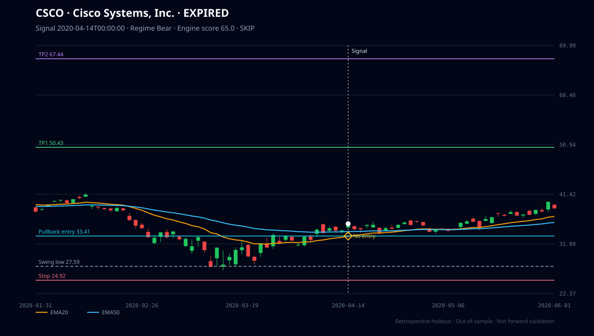

| Field | Audited value |
| --- | --- |
| Signal date / data timestamp | 2020-04-14 / `2020-04-14T00:00:00` |
| Market regime | Bear · engine 65 · The benchmark regime is risk-on based on 50/200-day EMA alignment. |
| Confidence / recommendation | 58 / SKIP |
| Signal price | 35.768772 |
| Proposed EMA20 pullback / expected fill | 33.406911 / 33.423615 |
| Actual entry | Not entered / — |
| Swing low / stop | 27.589236 / 24.920599 |
| TP1 / TP2 | 50.429647 / 67.435679 |
| £10,000 position size | 11 shares · £367.66 value |
| Maximum monetary risk | £93.53 of £100.00 budget |
| Holding period | 0 completed candles |
| Costs / slippage | £0.00 / £0.00 |
| Final result / normalized source ledger | No trade |
| MFE / MAE | Not applicable — no entry |
| Rejection or expiry reason | Pullback limit was not traded within 3 candles |

### Qualification audit

- Signal calculations used completed daily candles ending 2020-04-14; no later candle was supplied to the analysis engines.
- Signal-time EMA20 was 33.406911; the frozen entry window was 3 completed sessions.
- Signal-time ATR was 1.779091 and the 20-session swing low was 27.589236.
- Institutional market-regime score 65 met the frozen >=65 long-entry gate.
- None of the next 3 raw candles traded through the EMA20 limit; no position was opened.

### £10,000 account exit legs

No exit legs exist because no position was entered.

Audit checks: **16/16 passed**. Raw source: [`CSCO.csv`](../artifacts/trade_evidence/raw/CSCO.csv).

## E16 Rejected: GM

**General Motors Company · Consumer Discretionary**

**Classification:** RETROSPECTIVE HOLDOUT · OUT-OF-SAMPLE · NOT FORWARD VALIDATION

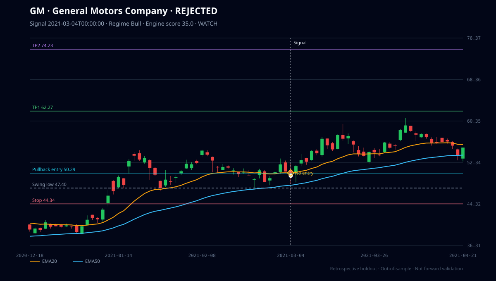

| Field | Audited value |
| --- | --- |
| Signal date / data timestamp | 2021-03-04 / `2021-03-04T00:00:00` |
| Market regime | Bull · engine 35 · The benchmark regime is defensive based on 50/200-day EMA alignment. |
| Confidence / recommendation | 71 / WATCH |
| Signal price | 49.781216 |
| Proposed EMA20 pullback / expected fill | 50.293801 / 50.318948 |
| Actual entry | Not entered / — |
| Swing low / stop | 47.399245 / 44.341699 |
| TP1 / TP2 | 62.273445 / 74.227943 |
| £10,000 position size | 16 shares · £805.10 value |
| Maximum monetary risk | £95.64 of £100.00 budget |
| Holding period | 0 completed candles |
| Costs / slippage | £0.00 / £0.00 |
| Final result / normalized source ledger | No trade |
| MFE / MAE | Not applicable — no entry |
| Rejection or expiry reason | Market regime filter disallowed long entry |

### Qualification audit

- Signal calculations used completed daily candles ending 2021-03-04; no later candle was supplied to the analysis engines.
- Signal-time EMA20 was 50.293801; the frozen entry window was 3 completed sessions.
- Signal-time ATR was 2.038364 and the 20-session swing low was 47.399245.
- Institutional market-regime score 35 failed the frozen >=65 long-entry gate.
- The market-regime gate failed before an entry could be activated; no position was opened.

### £10,000 account exit legs

No exit legs exist because no position was entered.

Audit checks: **16/16 passed**. Raw source: [`GM.csv`](../artifacts/trade_evidence/raw/GM.csv).

## E17 Winner: MCD

**McDonald's Corporation · Consumer Discretionary**

**Classification:** RETROSPECTIVE HOLDOUT · OUT-OF-SAMPLE · NOT FORWARD VALIDATION

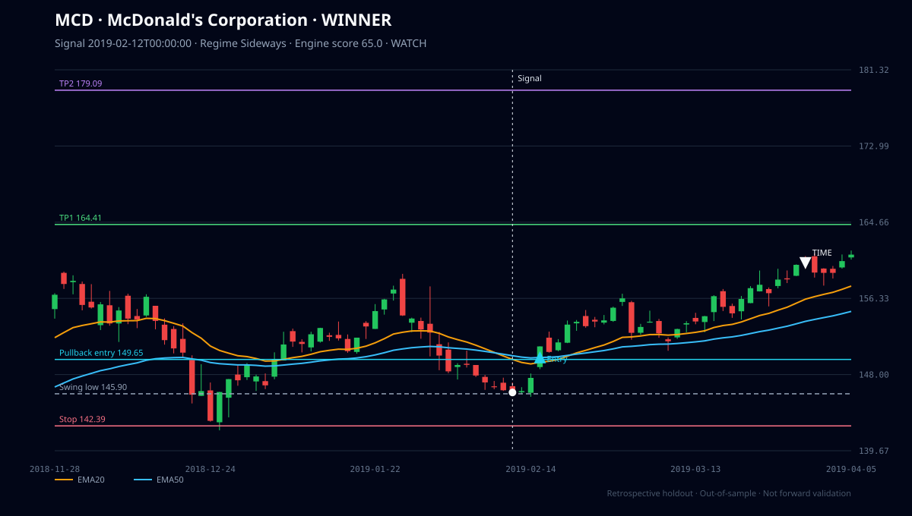

| Field | Audited value |
| --- | --- |
| Signal date / data timestamp | 2019-02-12 / `2019-02-12T00:00:00` |
| Market regime | Sideways · engine 65 · The benchmark regime is risk-on based on 50/200-day EMA alignment. |
| Confidence / recommendation | 60 / WATCH |
| Signal price | 146.040909 |
| Proposed EMA20 pullback / expected fill | 149.653768 / 149.728595 |
| Actual entry | 2019-02-15 / 149.728595 |
| Swing low / stop | 145.898202 / 142.388615 |
| TP1 / TP2 | 164.408555 / 179.088515 |
| £10,000 position size | 13 shares · £1946.47 value |
| Maximum monetary risk | £95.42 of £100.00 budget |
| Holding period | 30 completed candles |
| Costs / slippage | £2.02 / £2.02 |
| Final result / normalized source ledger | 1.425699R / £136.04 / 1.425699R |
| MFE / MAE | 1.529111R / -0.154733R |
| Rejection or expiry reason | Not applicable |

### Qualification audit

- Signal calculations used completed daily candles ending 2019-02-12; no later candle was supplied to the analysis engines.
- Signal-time EMA20 was 149.653768; the frozen entry window was 3 completed sessions.
- Signal-time ATR was 2.339725 and the 20-session swing low was 145.898202.
- Institutional market-regime score 65 met the frozen >=65 long-entry gate.
- The EMA20 limit traded on 2019-02-15, session 3 of 3.
- Stop 142.388615 was below executable fill 149.728595.
- Per-share risk was 4.9022% of entry, within the frozen 5% maximum.
- No same-ticker position overlapped this accepted entry.

### £10,000 account exit legs

| Leg | Date | Shares | Reference | Fill | Net P/L | R contribution |
| --- | --- | ---: | ---: | ---: | ---: | ---: |
| TIME | 2019-03-29 | 13 | 160.428452 | 160.348237 | £136.04 | 1.425699R |

Audit checks: **22/22 passed**. Raw source: [`MCD.csv`](../artifacts/trade_evidence/raw/MCD.csv).

## E18 Loser: MRK

**Merck & Co., Inc. · Health Care**

**Classification:** RETROSPECTIVE HOLDOUT · OUT-OF-SAMPLE · NOT FORWARD VALIDATION

| Field | Audited value |
| --- | --- |
| Signal date / data timestamp | 2021-04-12 / `2021-04-12T00:00:00` |
| Market regime | Bull · engine 90 · The benchmark regime is risk-on based on 50/200-day EMA alignment. |
| Confidence / recommendation | 59 / SKIP |
| Signal price | 61.694973 |
| Proposed EMA20 pullback / expected fill | 61.689233 / 61.720078 |
| Actual entry | 2021-04-13 / 61.720078 |
| Swing low / stop | 60.772224 / 59.308971 |
| TP1 / TP2 | 66.542292 / 71.364505 |
| £10,000 position size | 41 shares · £2530.52 value |
| Maximum monetary risk | £98.86 of £100.00 budget |
| Holding period | 13 completed candles |
| Costs / slippage | £2.48 / £2.48 |
| Final result / normalized source ledger | -1.037391R / £-102.55 / -1.037391R |
| MFE / MAE | 1.087362R / -1.141754R |
| Rejection or expiry reason | Not applicable |

### Qualification audit

- Signal calculations used completed daily candles ending 2021-04-12; no later candle was supplied to the analysis engines.
- Signal-time EMA20 was 61.689233; the frozen entry window was 3 completed sessions.
- Signal-time ATR was 0.975502 and the 20-session swing low was 60.772224.
- Institutional market-regime score 90 met the frozen >=65 long-entry gate.
- The EMA20 limit traded on 2021-04-13, session 1 of 3.
- Stop 59.308971 was below executable fill 61.720078.
- Per-share risk was 3.9065% of entry, within the frozen 5% maximum.
- No same-ticker position overlapped this accepted entry.

### £10,000 account exit legs

| Leg | Date | Shares | Reference | Fill | Net P/L | R contribution |
| --- | --- | ---: | ---: | ---: | ---: | ---: |
| STOP | 2021-04-29 | 41 | 59.308971 | 59.279317 | £-102.55 | -1.037391R |

Audit checks: **22/22 passed**. Raw source: [`MRK.csv`](../artifacts/trade_evidence/raw/MRK.csv).

## E19 Expired: SO

**The Southern Company · Utilities**

**Classification:** RETROSPECTIVE HOLDOUT · OUT-OF-SAMPLE · NOT FORWARD VALIDATION

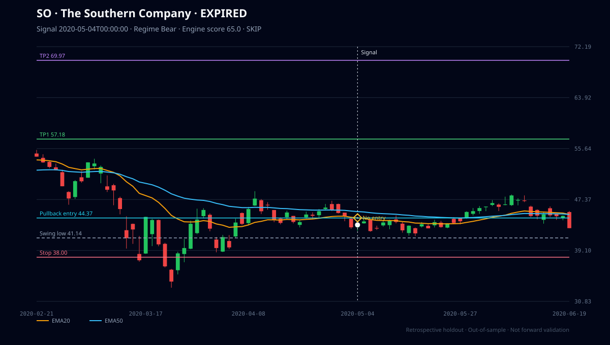

| Field | Audited value |
| --- | --- |
| Signal date / data timestamp | 2020-05-04 / `2020-05-04T00:00:00` |
| Market regime | Bear · engine 65 · The benchmark regime is risk-on based on 50/200-day EMA alignment. |
| Confidence / recommendation | 50 / SKIP |
| Signal price | 43.253620 |
| Proposed EMA20 pullback / expected fill | 44.373110 / 44.395296 |
| Actual entry | Not entered / — |
| Swing low / stop | 41.135035 / 38.001441 |
| TP1 / TP2 | 57.183008 / 69.970719 |
| £10,000 position size | 15 shares · £665.93 value |
| Maximum monetary risk | £95.91 of £100.00 budget |
| Holding period | 0 completed candles |
| Costs / slippage | £0.00 / £0.00 |
| Final result / normalized source ledger | No trade |
| MFE / MAE | Not applicable — no entry |
| Rejection or expiry reason | Pullback limit was not traded within 3 candles |

### Qualification audit

- Signal calculations used completed daily candles ending 2020-05-04; no later candle was supplied to the analysis engines.
- Signal-time EMA20 was 44.373110; the frozen entry window was 3 completed sessions.
- Signal-time ATR was 2.089063 and the 20-session swing low was 41.135035.
- Institutional market-regime score 65 met the frozen >=65 long-entry gate.
- None of the next 3 raw candles traded through the EMA20 limit; no position was opened.

### £10,000 account exit legs

No exit legs exist because no position was entered.

Audit checks: **16/16 passed**. Raw source: [`SO.csv`](../artifacts/trade_evidence/raw/SO.csv).

## E20 Rejected: CME

**CME Group Inc. · Financials**

**Classification:** RETROSPECTIVE HOLDOUT · OUT-OF-SAMPLE · NOT FORWARD VALIDATION

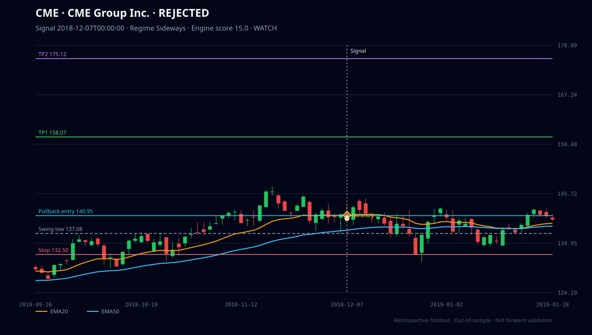

| Field | Audited value |
| --- | --- |
| Signal date / data timestamp | 2018-12-07 / `2018-12-07T00:00:00` |
| Market regime | Sideways · engine 15 · The benchmark regime is defensive based on 50/200-day EMA alignment. |
| Confidence / recommendation | 64 / WATCH |
| Signal price | 140.351257 |
| Proposed EMA20 pullback / expected fill | 140.951833 / 141.022309 |
| Actual entry | Not entered / — |
| Swing low / stop | 137.081384 / 132.498501 |
| TP1 / TP2 | 158.069924 / 175.117539 |
| £10,000 position size | 11 shares · £1551.25 value |
| Maximum monetary risk | £93.76 of £100.00 budget |
| Holding period | 0 completed candles |
| Costs / slippage | £0.00 / £0.00 |
| Final result / normalized source ledger | No trade |
| MFE / MAE | Not applicable — no entry |
| Rejection or expiry reason | Market regime filter disallowed long entry |

### Qualification audit

- Signal calculations used completed daily candles ending 2018-12-07; no later candle was supplied to the analysis engines.
- Signal-time EMA20 was 140.951833; the frozen entry window was 3 completed sessions.
- Signal-time ATR was 3.055255 and the 20-session swing low was 137.081384.
- Institutional market-regime score 15 failed the frozen >=65 long-entry gate.
- The market-regime gate failed before an entry could be activated; no position was opened.

### £10,000 account exit legs

No exit legs exist because no position was entered.

Audit checks: **16/16 passed**. Raw source: [`CME.csv`](../artifacts/trade_evidence/raw/CME.csv).

## E21 Winner: VLO

**Valero Energy Corporation · Energy**

**Classification:** RETROSPECTIVE HOLDOUT · OUT-OF-SAMPLE · NOT FORWARD VALIDATION

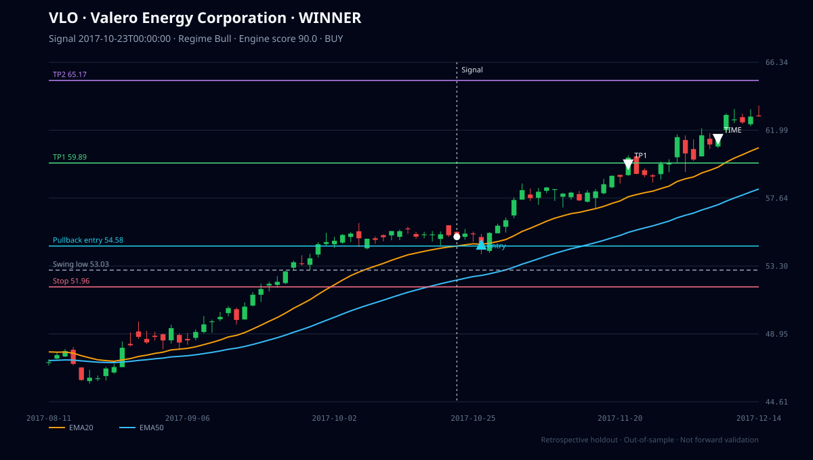

| Field | Audited value |
| --- | --- |
| Signal date / data timestamp | 2017-10-23 / `2017-10-23T00:00:00` |
| Market regime | Bull · engine 90 · The benchmark regime is risk-on based on 50/200-day EMA alignment. |
| Confidence / recommendation | 78 / BUY |
| Signal price | 55.163815 |
| Proposed EMA20 pullback / expected fill | 54.575690 / 54.602978 |
| Actual entry | 2017-10-26 / 54.602978 |
| Swing low / stop | 53.032813 / 51.960665 |
| TP1 / TP2 | 59.887604 / 65.172230 |
| £10,000 position size | 37 shares · £2020.31 value |
| Maximum monetary risk | £97.77 of £100.00 budget |
| Holding period | 30 completed candles |
| Costs / slippage | £2.13 / £2.13 |
| Final result / normalized source ledger | 2.284037R / £223.30 / 2.275694R |
| MFE / MAE | 2.843777R / -0.208523R |
| Rejection or expiry reason | Not applicable |

### Qualification audit

- Signal calculations used completed daily candles ending 2017-10-23; no later candle was supplied to the analysis engines.
- Signal-time EMA20 was 54.575690; the frozen entry window was 3 completed sessions.
- Signal-time ATR was 0.714765 and the 20-session swing low was 53.032813.
- Institutional market-regime score 90 met the frozen >=65 long-entry gate.
- The EMA20 limit traded on 2017-10-26, session 3 of 3.
- Stop 51.960665 was below executable fill 54.602978.
- Per-share risk was 4.8391% of entry, within the frozen 5% maximum.
- No same-ticker position overlapped this accepted entry.

### £10,000 account exit legs

| Leg | Date | Shares | Reference | Fill | Net P/L | R contribution |
| --- | --- | ---: | ---: | ---: | ---: | ---: |
| TP1 | 2017-11-21 | 18 | 59.887604 | 59.857660 | £93.55 | 0.956923R |
| TIME | 2017-12-07 | 19 | 61.520527 | 61.489767 | £129.75 | 1.327114R |

Audit checks: **22/22 passed**. Raw source: [`VLO.csv`](../artifacts/trade_evidence/raw/VLO.csv).

## E22 Loser: ETN

**Eaton Corporation plc · Industrials**

**Classification:** RETROSPECTIVE HOLDOUT · OUT-OF-SAMPLE · NOT FORWARD VALIDATION

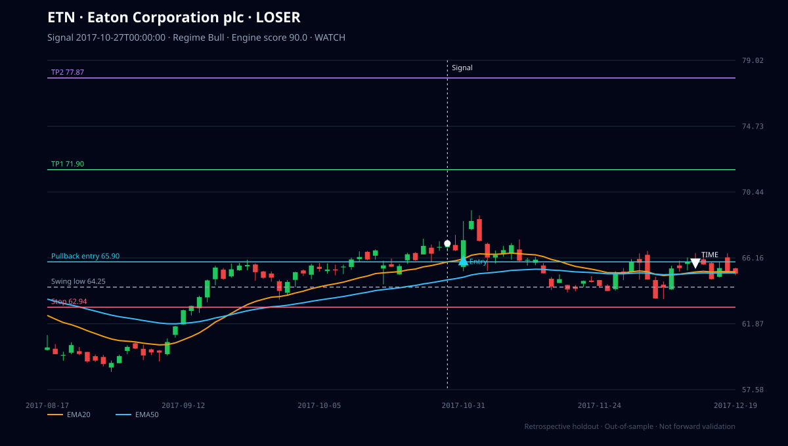

| Field | Audited value |
| --- | --- |
| Signal date / data timestamp | 2017-10-27 / `2017-10-27T00:00:00` |
| Market regime | Bull · engine 90 · The benchmark regime is risk-on based on 50/200-day EMA alignment. |
| Confidence / recommendation | 71 / WATCH |
| Signal price | 67.097435 |
| Proposed EMA20 pullback / expected fill | 65.897317 / 65.930266 |
| Actual entry | 2017-10-31 / 65.930266 |
| Swing low / stop | 64.254410 / 62.944727 |
| TP1 / TP2 | 71.901345 / 77.872423 |
| £10,000 position size | 33 shares · £2175.70 value |
| Maximum monetary risk | £98.52 of £100.00 budget |
| Holding period | 30 completed candles |
| Costs / slippage | £2.17 / £2.17 |
| Final result / normalized source ledger | -0.045998R / £-4.53 / -0.045998R |
| MFE / MAE | 1.115008R / -0.824627R |
| Rejection or expiry reason | Not applicable |

### Qualification audit

- Signal calculations used completed daily candles ending 2017-10-27; no later candle was supplied to the analysis engines.
- Signal-time EMA20 was 65.897317; the frozen entry window was 3 completed sessions.
- Signal-time ATR was 0.873122 and the 20-session swing low was 64.254410.
- Institutional market-regime score 90 met the frozen >=65 long-entry gate.
- The EMA20 limit traded on 2017-10-31, session 2 of 3.
- Stop 62.944727 was below executable fill 65.930266.
- Per-share risk was 4.5283% of entry, within the frozen 5% maximum.
- No same-ticker position overlapped this accepted entry.

### £10,000 account exit legs

| Leg | Date | Shares | Reference | Fill | Net P/L | R contribution |
| --- | --- | ---: | ---: | ---: | ---: | ---: |
| TIME | 2017-12-12 | 33 | 65.891777 | 65.858831 | £-4.53 | -0.045998R |

Audit checks: **22/22 passed**. Raw source: [`ETN.csv`](../artifacts/trade_evidence/raw/ETN.csv).

## E23 Winner: LIN

**Linde plc · Materials**

**Classification:** RETROSPECTIVE HOLDOUT · OUT-OF-SAMPLE · NOT FORWARD VALIDATION

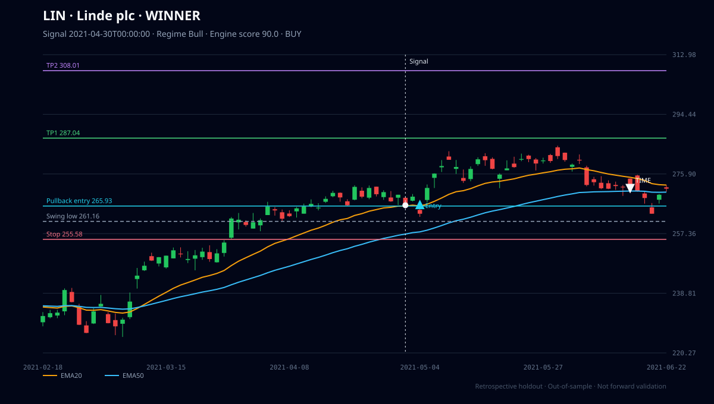

| Field | Audited value |
| --- | --- |
| Signal date / data timestamp | 2021-04-30 / `2021-04-30T00:00:00` |
| Market regime | Bull · engine 90 · The benchmark regime is risk-on based on 50/200-day EMA alignment. |
| Confidence / recommendation | 80 / BUY |
| Signal price | 266.175079 |
| Proposed EMA20 pullback / expected fill | 265.931019 / 266.063985 |
| Actual entry | 2021-05-04 / 266.063985 |
| Swing low / stop | 261.155941 / 255.576457 |
| TP1 / TP2 | 287.039040 / 308.014096 |
| £10,000 position size | 9 shares · £2394.58 value |
| Maximum monetary risk | £94.39 of £100.00 budget |
| Holding period | 30 completed candles |
| Costs / slippage | £2.42 / £2.42 |
| Final result / normalized source ledger | 0.513076R / £48.43 / 0.513076R |
| MFE / MAE | 1.774886R / -0.334802R |
| Rejection or expiry reason | Not applicable |

### Qualification audit

- Signal calculations used completed daily candles ending 2021-04-30; no later candle was supplied to the analysis engines.
- Signal-time EMA20 was 265.931019; the frozen entry window was 3 completed sessions.
- Signal-time ATR was 3.719656 and the 20-session swing low was 261.155941.
- Institutional market-regime score 90 met the frozen >=65 long-entry gate.
- The EMA20 limit traded on 2021-05-04, session 2 of 3.
- Stop 255.576457 was below executable fill 266.063985.
- Per-share risk was 3.9417% of entry, within the frozen 5% maximum.
- No same-ticker position overlapped this accepted entry.

### £10,000 account exit legs

| Leg | Date | Shares | Reference | Fill | Net P/L | R contribution |
| --- | --- | ---: | ---: | ---: | ---: | ---: |
| TIME | 2021-06-15 | 9 | 271.849701 | 271.713776 | £48.43 | 0.513076R |

Audit checks: **22/22 passed**. Raw source: [`LIN.csv`](../artifacts/trade_evidence/raw/LIN.csv).

## E24 Loser: EQR

**Equity Residential · Real Estate**

**Classification:** RETROSPECTIVE HOLDOUT · OUT-OF-SAMPLE · NOT FORWARD VALIDATION

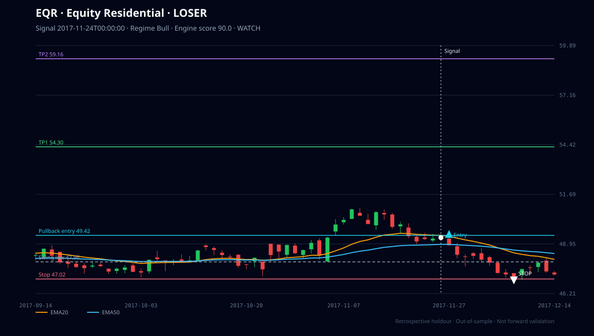

| Field | Audited value |
| --- | --- |
| Signal date / data timestamp | 2017-11-24 / `2017-11-24T00:00:00` |
| Market regime | Bull · engine 90 · The benchmark regime is risk-on based on 50/200-day EMA alignment. |
| Confidence / recommendation | 62 / WATCH |
| Signal price | 49.295742 |
| Proposed EMA20 pullback / expected fill | 49.419401 / 49.444111 |
| Actual entry | 2017-11-27 / 49.444111 |
| Swing low / stop | 47.958738 / 47.015169 |
| TP1 / TP2 | 54.301995 / 59.159879 |
| £10,000 position size | 41 shares · £2027.21 value |
| Maximum monetary risk | £99.59 of £100.00 budget |
| Holding period | 9 completed candles |
| Costs / slippage | £1.98 / £1.98 |
| Final result / normalized source ledger | -1.029530R / £-102.53 / -1.029530R |
| MFE / MAE | 0.000000R / -1.028087R |
| Rejection or expiry reason | Not applicable |

### Qualification audit

- Signal calculations used completed daily candles ending 2017-11-24; no later candle was supplied to the analysis engines.
- Signal-time EMA20 was 49.419401; the frozen entry window was 3 completed sessions.
- Signal-time ATR was 0.629046 and the 20-session swing low was 47.958738.
- Institutional market-regime score 90 met the frozen >=65 long-entry gate.
- The EMA20 limit traded on 2017-11-27, session 1 of 3.
- Stop 47.015169 was below executable fill 49.444111.
- Per-share risk was 4.9125% of entry, within the frozen 5% maximum.
- No same-ticker position overlapped this accepted entry.

### £10,000 account exit legs

| Leg | Date | Shares | Reference | Fill | Net P/L | R contribution |
| --- | --- | ---: | ---: | ---: | ---: | ---: |
| STOP | 2017-12-07 | 41 | 47.015169 | 46.991661 | £-102.53 | -1.029530R |

Audit checks: **22/22 passed**. Raw source: [`EQR.csv`](../artifacts/trade_evidence/raw/EQR.csv).

## E25 Winner: MSFT

**Microsoft Corporation · Technology**

**Classification:** RETROSPECTIVE HOLDOUT · OUT-OF-SAMPLE · NOT FORWARD VALIDATION

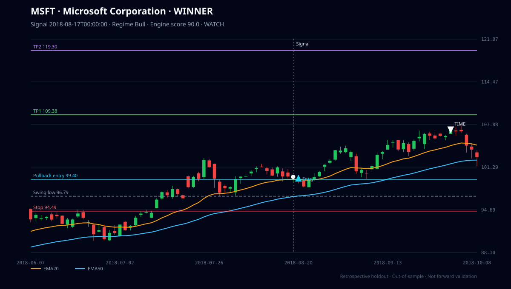

| Field | Audited value |
| --- | --- |
| Signal date / data timestamp | 2018-08-17 / `2018-08-17T00:00:00` |
| Market regime | Bull · engine 90 · The benchmark regime is risk-on based on 50/200-day EMA alignment. |
| Confidence / recommendation | 66 / WATCH |
| Signal price | 99.779572 |
| Proposed EMA20 pullback / expected fill | 99.400033 / 99.449733 |
| Actual entry | 2018-08-20 / 99.449733 |
| Swing low / stop | 96.791562 / 94.486401 |
| TP1 / TP2 | 109.376396 / 119.303058 |
| £10,000 position size | 20 shares · £1988.99 value |
| Maximum monetary risk | £99.27 of £100.00 budget |
| Holding period | 30 completed candles |
| Costs / slippage | £2.07 / £2.07 |
| Final result / normalized source ledger | 1.535395R / £152.41 / 1.535395R |
| MFE / MAE | 1.580093R / -0.269912R |
| Rejection or expiry reason | Not applicable |

### Qualification audit

- Signal calculations used completed daily candles ending 2018-08-17; no later candle was supplied to the analysis engines.
- Signal-time EMA20 was 99.400033; the frozen entry window was 3 completed sessions.
- Signal-time ATR was 1.536774 and the 20-session swing low was 96.791562.
- Institutional market-regime score 90 met the frozen >=65 long-entry gate.
- The EMA20 limit traded on 2018-08-20, session 1 of 3.
- Stop 94.486401 was below executable fill 99.449733.
- Per-share risk was 4.9908% of entry, within the frozen 5% maximum.
- No same-ticker position overlapped this accepted entry.

### £10,000 account exit legs

| Leg | Date | Shares | Reference | Fill | Net P/L | R contribution |
| --- | --- | ---: | ---: | ---: | ---: | ---: |
| TIME | 2018-10-01 | 20 | 107.227333 | 107.173719 | £152.41 | 1.535395R |

Audit checks: **22/22 passed**. Raw source: [`MSFT.csv`](../artifacts/trade_evidence/raw/MSFT.csv).

## E26 Loser: SHW

**The Sherwin-Williams Company · Materials**

**Classification:** RETROSPECTIVE HOLDOUT · OUT-OF-SAMPLE · NOT FORWARD VALIDATION

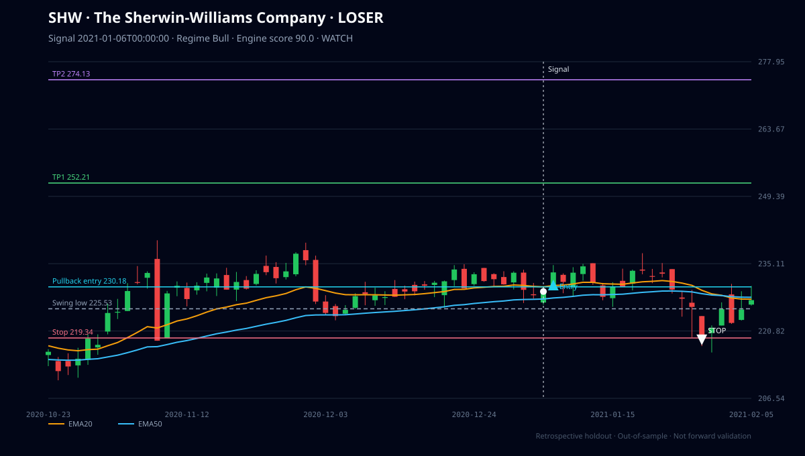

| Field | Audited value |
| --- | --- |
| Signal date / data timestamp | 2021-01-06 / `2021-01-06T00:00:00` |
| Market regime | Bull · engine 90 · The benchmark regime is risk-on based on 50/200-day EMA alignment. |
| Confidence / recommendation | 73 / WATCH |
| Signal price | 229.199783 |
| Proposed EMA20 pullback / expected fill | 230.184847 / 230.299939 |
| Actual entry | 2021-01-07 / 230.299939 |
| Swing low / stop | 225.534986 / 219.343424 |
| TP1 / TP2 | 252.212970 / 274.126001 |
| £10,000 position size | 9 shares · £2072.70 value |
| Maximum monetary risk | £98.61 of £100.00 budget |
| Holding period | 16 completed candles |
| Costs / slippage | £2.02 / £2.02 |
| Final result / normalized source ledger | -1.030524R / £-101.62 / -1.030524R |
| MFE / MAE | 0.641532R / -1.157441R |
| Rejection or expiry reason | Not applicable |

### Qualification audit

- Signal calculations used completed daily candles ending 2021-01-06; no later candle was supplied to the analysis engines.
- Signal-time EMA20 was 230.184847; the frozen entry window was 3 completed sessions.
- Signal-time ATR was 4.127708 and the 20-session swing low was 225.534986.
- Institutional market-regime score 90 met the frozen >=65 long-entry gate.
- The EMA20 limit traded on 2021-01-07, session 1 of 3.
- Stop 219.343424 was below executable fill 230.299939.
- Per-share risk was 4.7575% of entry, within the frozen 5% maximum.
- No same-ticker position overlapped this accepted entry.

### £10,000 account exit legs

| Leg | Date | Shares | Reference | Fill | Net P/L | R contribution |
| --- | --- | ---: | ---: | ---: | ---: | ---: |
| STOP | 2021-01-29 | 9 | 219.343424 | 219.233752 | £-101.62 | -1.030524R |

Audit checks: **22/22 passed**. Raw source: [`SHW.csv`](../artifacts/trade_evidence/raw/SHW.csv).

## E27 Winner: DHR

**Danaher Corporation · Health Care**

**Classification:** RETROSPECTIVE HOLDOUT · OUT-OF-SAMPLE · NOT FORWARD VALIDATION

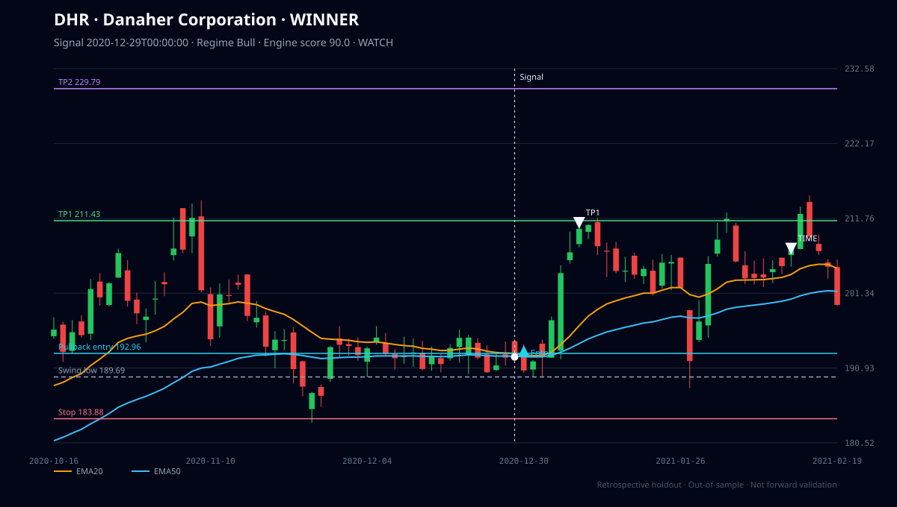

| Field | Audited value |
| --- | --- |
| Signal date / data timestamp | 2020-12-29 / `2020-12-29T00:00:00` |
| Market regime | Bull · engine 90 · The benchmark regime is risk-on based on 50/200-day EMA alignment. |
| Confidence / recommendation | 60 / WATCH |
| Signal price | 192.470993 |
| Proposed EMA20 pullback / expected fill | 192.964562 / 193.061044 |
| Actual entry | 2020-12-30 / 193.061044 |
| Swing low / stop | 189.690578 / 183.878207 |
| TP1 / TP2 | 211.426718 / 229.792391 |
| £10,000 position size | 10 shares · £1930.61 value |
| Maximum monetary risk | £91.83 of £100.00 budget |
| Holding period | 30 completed candles |
| Costs / slippage | £2.01 / £2.01 |
| Final result / normalized source ledger | 1.771578R / £162.68 / 1.771578R |
| MFE / MAE | 2.123337R / -0.537324R |
| Rejection or expiry reason | Not applicable |

### Qualification audit

- Signal calculations used completed daily candles ending 2020-12-29; no later candle was supplied to the analysis engines.
- Signal-time EMA20 was 192.964562; the frozen entry window was 3 completed sessions.
- Signal-time ATR was 3.874914 and the 20-session swing low was 189.690578.
- Institutional market-regime score 90 met the frozen >=65 long-entry gate.
- The EMA20 limit traded on 2020-12-30, session 1 of 3.
- Stop 183.878207 was below executable fill 193.061044.
- Per-share risk was 4.7564% of entry, within the frozen 5% maximum.
- No same-ticker position overlapped this accepted entry.

### £10,000 account exit legs

| Leg | Date | Shares | Reference | Fill | Net P/L | R contribution |
| --- | --- | ---: | ---: | ---: | ---: | ---: |
| TP1 | 2021-01-08 | 5 | 211.426718 | 211.321004 | £90.29 | 0.983235R |
| TIME | 2021-02-11 | 5 | 207.843826 | 207.739904 | £72.39 | 0.788344R |

Audit checks: **22/22 passed**. Raw source: [`DHR.csv`](../artifacts/trade_evidence/raw/DHR.csv).

## E28 Loser: EXC

**Exelon Corporation · Utilities**

**Classification:** RETROSPECTIVE HOLDOUT · OUT-OF-SAMPLE · NOT FORWARD VALIDATION

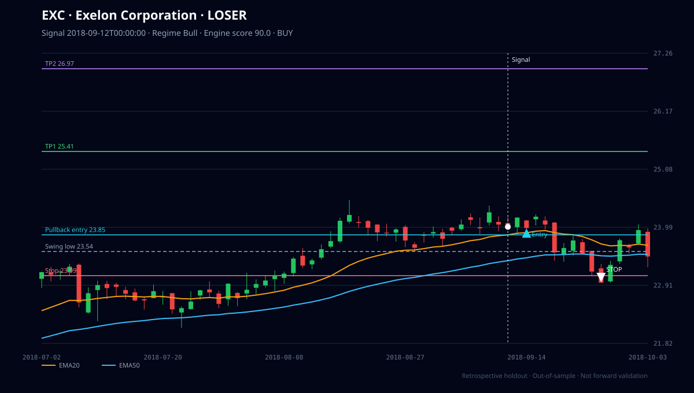

| Field | Audited value |
| --- | --- |
| Signal date / data timestamp | 2018-09-12 / `2018-09-12T00:00:00` |
| Market regime | Bull · engine 90 · The benchmark regime is risk-on based on 50/200-day EMA alignment. |
| Confidence / recommendation | 75 / BUY |
| Signal price | 24.000700 |
| Proposed EMA20 pullback / expected fill | 23.850521 / 23.862446 |
| Actual entry | 2018-09-14 / 23.862446 |
| Swing low / stop | 23.538304 / 23.086785 |
| TP1 / TP2 | 25.413768 / 26.965091 |
| £10,000 position size | 128 shares · £3054.39 value |
| Maximum monetary risk | £99.28 of £100.00 budget |
| Holding period | 9 completed candles |
| Costs / slippage | £3.00 / £3.00 |
| Final result / normalized source ledger | -1.045139R / £-103.77 / -1.045139R |
| MFE / MAE | 0.479806R / -1.175312R |
| Rejection or expiry reason | Not applicable |

### Qualification audit

- Signal calculations used completed daily candles ending 2018-09-12; no later candle was supplied to the analysis engines.
- Signal-time EMA20 was 23.850521; the frozen entry window was 3 completed sessions.
- Signal-time ATR was 0.301013 and the 20-session swing low was 23.538305.
- Institutional market-regime score 90 met the frozen >=65 long-entry gate.
- The EMA20 limit traded on 2018-09-14, session 2 of 3.
- Stop 23.086785 was below executable fill 23.862446.
- Per-share risk was 3.2506% of entry, within the frozen 5% maximum.
- No same-ticker position overlapped this accepted entry.

### £10,000 account exit legs

| Leg | Date | Shares | Reference | Fill | Net P/L | R contribution |
| --- | --- | ---: | ---: | ---: | ---: | ---: |
| STOP | 2018-09-26 | 128 | 23.086785 | 23.075242 | £-103.77 | -1.045139R |

Audit checks: **22/22 passed**. Raw source: [`EXC.csv`](../artifacts/trade_evidence/raw/EXC.csv).

## E29 Winner: T

**AT&T Inc. · Communication Services**

**Classification:** RETROSPECTIVE HOLDOUT · OUT-OF-SAMPLE · NOT FORWARD VALIDATION

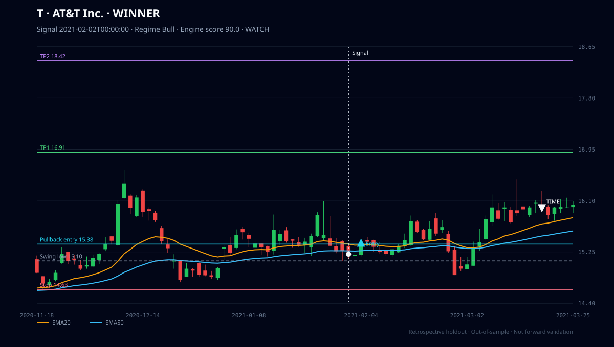

| Field | Audited value |
| --- | --- |
| Signal date / data timestamp | 2021-02-02 / `2021-02-02T00:00:00` |
| Market regime | Bull · engine 90 · The benchmark regime is risk-on based on 50/200-day EMA alignment. |
| Confidence / recommendation | 62 / WATCH |
| Signal price | 15.216127 |
| Proposed EMA20 pullback / expected fill | 15.382904 / 15.390596 |
| Actual entry | 2021-02-04 / 15.390596 |
| Swing low / stop | 15.104167 / 14.632372 |
| TP1 / TP2 | 16.907042 / 18.423489 |
| £10,000 position size | 131 shares · £2016.17 value |
| Maximum monetary risk | £99.33 of £100.00 budget |
| Holding period | 30 completed candles |
| Costs / slippage | £2.06 / £2.06 |
| Final result / normalized source ledger | 0.772295R / £76.71 / 0.772295R |
| MFE / MAE | 1.408259R / -0.687149R |
| Rejection or expiry reason | Not applicable |

### Qualification audit

- Signal calculations used completed daily candles ending 2021-02-02; no later candle was supplied to the analysis engines.
- Signal-time EMA20 was 15.382904; the frozen entry window was 3 completed sessions.
- Signal-time ATR was 0.314530 and the 20-session swing low was 15.104167.
- Institutional market-regime score 90 met the frozen >=65 long-entry gate.
- The EMA20 limit traded on 2021-02-04, session 2 of 3.
- Stop 14.632372 was below executable fill 15.390596.
- Per-share risk was 4.9265% of entry, within the frozen 5% maximum.
- No same-ticker position overlapped this accepted entry.

### £10,000 account exit legs

| Leg | Date | Shares | Reference | Fill | Net P/L | R contribution |
| --- | --- | ---: | ---: | ---: | ---: | ---: |
| TIME | 2021-03-18 | 131 | 15.999859 | 15.991859 | £76.71 | 0.772295R |

Audit checks: **22/22 passed**. Raw source: [`T.csv`](../artifacts/trade_evidence/raw/T.csv).

## E30 Loser: KMI

**Kinder Morgan, Inc. · Energy**

**Classification:** RETROSPECTIVE HOLDOUT · OUT-OF-SAMPLE · NOT FORWARD VALIDATION

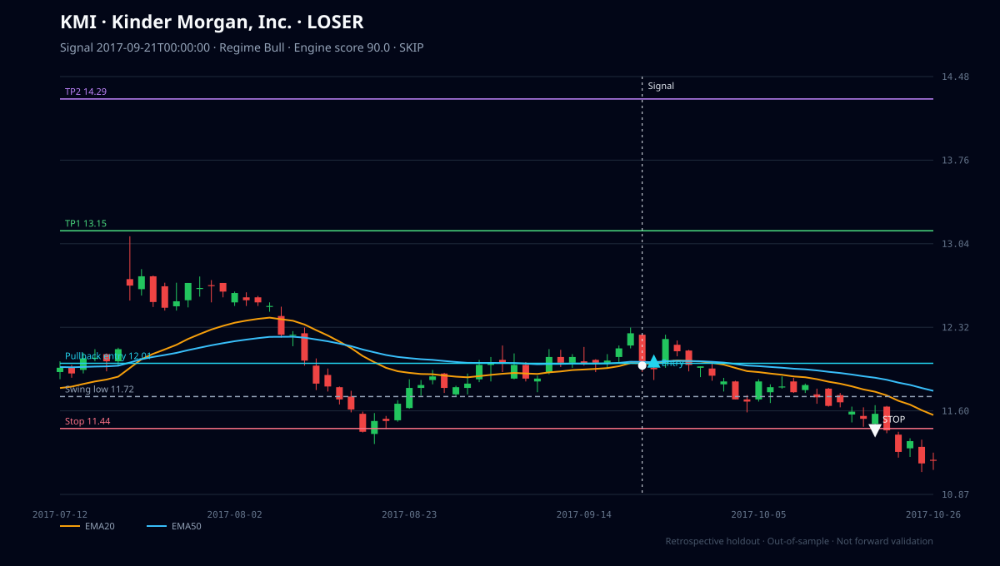

| Field | Audited value |
| --- | --- |
| Signal date / data timestamp | 2017-09-21 / `2017-09-21T00:00:00` |
| Market regime | Bull · engine 90 · The benchmark regime is risk-on based on 50/200-day EMA alignment. |
| Confidence / recommendation | 58 / SKIP |
| Signal price | 11.986182 |
| Proposed EMA20 pullback / expected fill | 12.006299 / 12.012302 |
| Actual entry | 2017-09-22 / 12.012302 |
| Swing low / stop | 11.719411 / 11.443478 |
| TP1 / TP2 | 13.149950 / 14.287598 |
| £10,000 position size | 175 shares · £2102.15 value |
| Maximum monetary risk | £99.54 of £100.00 budget |
| Holding period | 20 completed candles |
| Costs / slippage | £2.05 / £2.05 |
| Final result / normalized source ledger | -1.030672R / £-102.60 / -1.030672R |
| MFE / MAE | 0.423075R / -1.027525R |
| Rejection or expiry reason | Not applicable |

### Qualification audit

- Signal calculations used completed daily candles ending 2017-09-21; no later candle was supplied to the analysis engines.
- Signal-time EMA20 was 12.006299; the frozen entry window was 3 completed sessions.
- Signal-time ATR was 0.183955 and the 20-session swing low was 11.719411.
- Institutional market-regime score 90 met the frozen >=65 long-entry gate.
- The EMA20 limit traded on 2017-09-22, session 1 of 3.
- Stop 11.443478 was below executable fill 12.012302.
- Per-share risk was 4.7353% of entry, within the frozen 5% maximum.
- No same-ticker position overlapped this accepted entry.

### £10,000 account exit legs

| Leg | Date | Shares | Reference | Fill | Net P/L | R contribution |
| --- | --- | ---: | ---: | ---: | ---: | ---: |
| STOP | 2017-10-19 | 175 | 11.443478 | 11.437756 | £-102.60 | -1.030672R |

Audit checks: **22/22 passed**. Raw source: [`KMI.csv`](../artifacts/trade_evidence/raw/KMI.csv).
